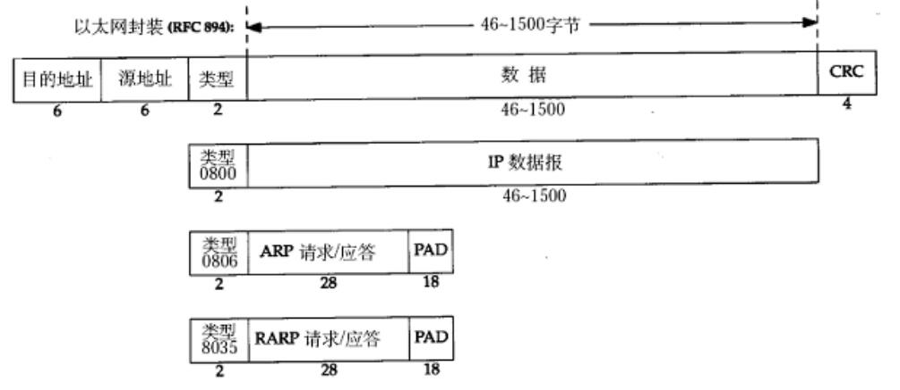
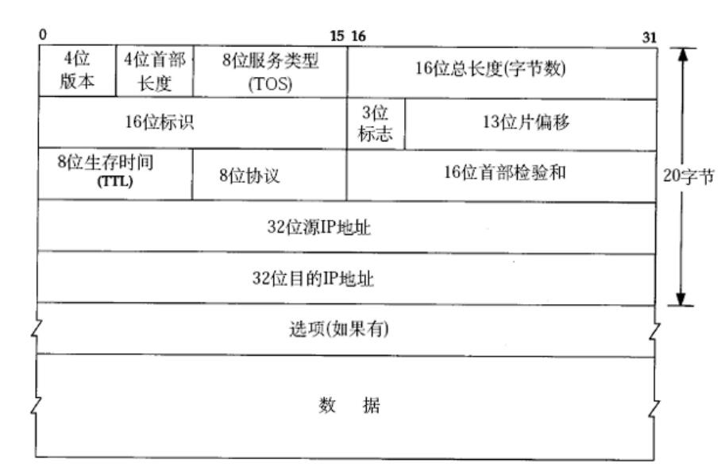
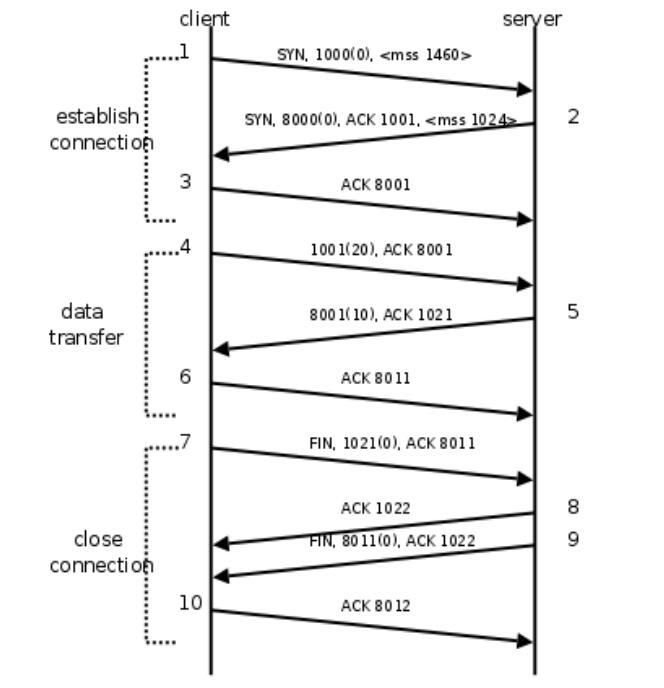
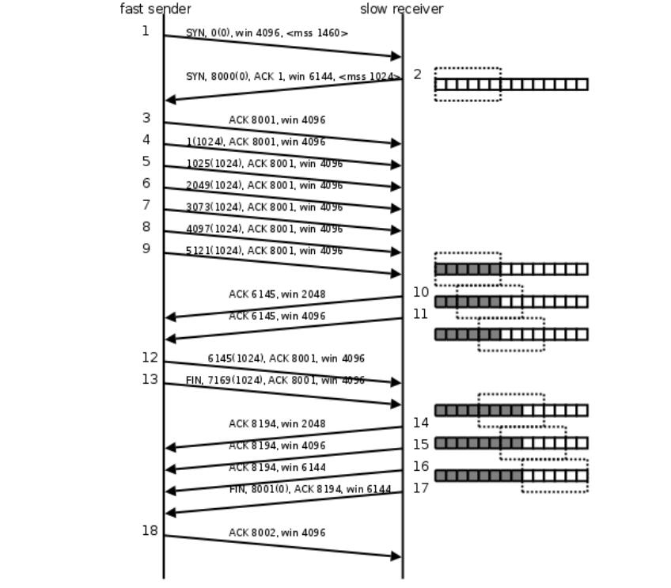
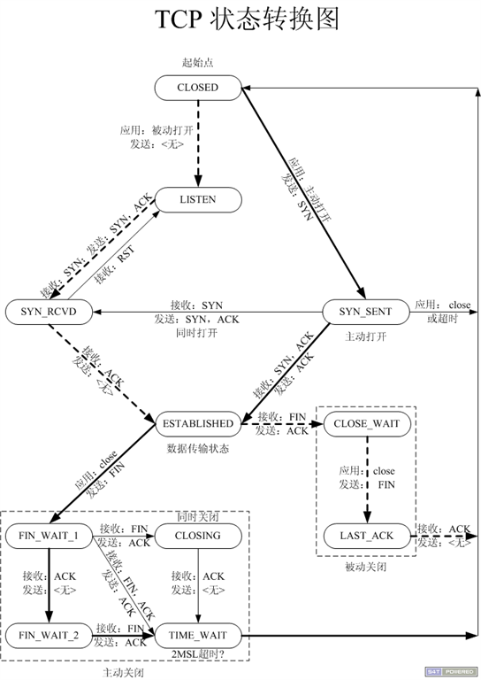
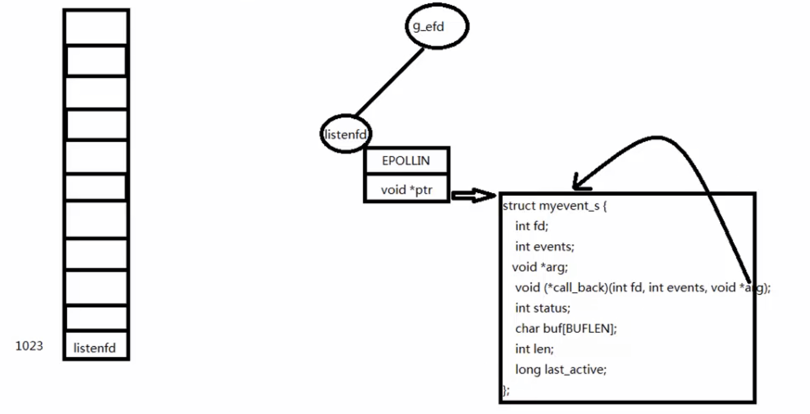

## 1. 基本概念

man 7 ip
nc localhost 6666 测试连接

### B/S、C/S

C/S优点：协议选择灵活、缓冲数据

C/S缺点：对用户安全构成威胁、开发工作量大

B/S优点：开发工作量小、可移植

B/S缺点：网络应用支持受限、缓存数据差、协议不灵活


### OSI 七层模型


1. 物理层：主要定义物理设备标准，如网线的接口类型、光纤的接口类型、各种传输介质的传输速率等。它的主要作用是传输比特流（就是由1、0转化为电流强弱来进行传输，到达目的地后再转化为1、0，也就是我们常说的数模转换与模数转换）。这一层的数据叫做比特。

2. 数据链路层：定义了如何让格式化数据以帧为单位进行传输，以及如何让控制对物理介质的访问。这一层通常还提供错误检测和纠正，以确保数据的可靠传输。如：串口通信中使用到的115200、8、N、1

3. 网络层：在位于不同地理位置的网络中的两个主机系统之间提供连接和路径选择。Internet的发展使得从世界各站点访问信息的用户数大大增加，而网络层正是管理这种连接的层。

4. 传输层：定义了一些传输数据的协议和端口号（WWW端口80等），如：TCP（传输控制协议，传输效率低，可靠性强，用于传输可靠性要求高，数据量大的数据），UDP（用户数据报协议，与TCP特性恰恰相反，用于传输可靠性要求不高，数据量小的数据，如QQ聊天数据就是通过这种方式传输的）。 主要是将从下层接收的数据进行分段和传输，到达目的地址后再进行重组。常常把这一层数据叫做段。

5. 会话层：通过传输层(端口号：传输端口与接收端口)建立数据传输的通路。主要在你的系统之间发起会话或者接受会话请求（设备之间需要互相认识可以是IP也可以是MAC或者是主机名）。

6. 表示层：可确保一个系统的应用层所发送的信息可以被另一个系统的应用层读取。例如，PC程序与另一台计算机进行通信，其中一台计算机使用扩展二一十进制交换码(EBCDIC)，而另一台则使用美国信息交换标准码（ASCII）来表示相同的字符。如有必要，表示层会通过使用一种通格式来实现多种数据格式之间的转换。
7. 应用层：是最靠近用户的OSI层。这一层为用户的应用程序（例如电子邮件、文件传输和终端仿真）提供网络服务。

### TCP/IP四层模型


### 数据包封装

不同的协议层对数据包有不同的称谓，在传输层叫做段（segment），在网络层叫做数据报（datagram），在链路层叫做帧（frame）。数据封装成帧后发到传输介质上，到达目的主机后每层协议再剥掉相应的首部，最后将应用层数据交给应用程序处理。


### 以太网帧



的源地址和目的地址是指网卡的硬件地址（也叫MAC地址），长度是48位，是在网卡出厂时固化的。可在shell中使用ifconfig命令查看，“HWaddr 00:15:F2:14:9E:3F”部分就是硬件地址。

协议字段有三种值，分别对应IP、ARP、RARP。帧尾是CRC校验码。
以太网帧中的数据长度规定最小46字节，最大1500字节，ARP和RARP数据包的长度不够46字节，要在后面补填充位。最大值1500称为以太网的最大传输单元（MTU），不同的网络类型有不同的MTU，如果一个数据包从以太网路由到拨号链路上，数据包长度大于拨号链路的MTU，则需要对数据包进行分片（fragmentation）。ifconfig命令输出中也有“MTU:1500”。注意，MTU这个概念指数据帧中有效载荷的最大长度，不包括帧头长度。


### ARP数据包


在网络通讯时，源主机的应用程序知道目的主机的IP地址和端口号，却不知道目的主机的硬件地址，而数据包首先是被网卡接收到再去处理上层协议的，如果接收到的数据包的硬件地址与本机不符，则直接丢弃。因此在通讯前必须获得目的主机的硬件地址。ARP协议就起到这个作用。源主机发出ARP请求，询问“IP地址是192.168.0.1的主机的硬件地址是多少”，并将这个请求广播到本地网段（以太网帧首部的硬件地址填FF:FF:FF:FF:FF:FF表示广播），目的主机接收到广播的ARP请求，发现其中的IP地址与本机相符，则发送一个ARP应答数据包给源主机，将自己的硬件地址填写在应答包中。

每台主机都维护一个ARP缓存表，可以用arp -a命令查看。缓存表中的表项有过期时间（一般为20分钟），如果20分钟内没有再次使用某个表项，则该表项失效，下次还要发ARP请求来获得目的主机的硬件地址。想一想，为什么表项要有过期时间而不是一直有效？

源MAC地址、目的MAC地址在以太网首部和ARP请求中各出现一次，对于链路层为以太网的情况是多余的，但如果链路层是其它类型的网络则有可能是必要的。硬件类型指链路层网络类型，1为以太网，协议类型指要转换的地址类型，0x0800为IP地址，后面两个地址长度对于以太网地址和IP地址分别为6和4（字节），op字段为1表示ARP请求，op字段为2表示ARP应答。


### IP数据包



IP数据报的首部长度和数据长度都是可变长的，但总是4字节的整数倍。对于IPv4，4位版本字段是4。4位首部长度的数值是以4字节为单位的，最小值为5，也就是说首部长度最小是4x5=20字节，也就是不带任何选项的IP首部，4位能表示的最大值是15，也就是说首部长度最大是60字节。

8位TOS字段有3个位用来指定IP数据报的优先级（目前已经废弃不用），还有4个位表示可选的服务类型（最小延迟、最大?吐量、最大可靠性、最小成本），还有一个位总是0。总长度是整个数据报（包括IP首部和IP层payload）的字节数。
每传一个IP数据报，16位的标识加1，可用于分片和重新组装数据报。
3位标志和13位片偏移用于分片。
TTL（Time to live)是这样用的：源主机为数据包设定一个生存时间，比如64，每过一个路由器就把该值减1，如果减到0就表示路由已经太长了仍然找不到目的主机的网络，就丢弃该包，因此这个生存时间的单位不是秒，而是跳（hop）。
协议字段指示上层协议是TCP、UDP、ICMP还是IGMP。然后是校验和，只校验IP首部，数据的校验由更高层协议负责。IPv4的IP地址长度为32位。


### UDP数据报


### TCP数据报


### TCP通讯时序




**三次握手**

1. 客户端发送一个带SYN标志的TCP报文到服务器。这是三次握手过程中的段1。

   客户端发出段1，SYN位表示连接请求。序号是1000，这个序号在网络通讯中用作临时的地址，每发一个数据字节，这个序号要加1，这样在接收端可以根据序号排出数据包的正确顺序，也可以发现丢包的情况，另外，规定SYN位和FIN位也要占一个序号，这次虽然没发数据，但是由于发了SYN位，因此下次再发送应该用序号1001。mss表示最大段尺寸，如果一个段太大，封装成帧后超过了链路层的最大帧长度，就必须在IP层分片，为了避免这种情况，客户端声明自己的最大段尺寸，建议服务器端发来的段不要超过这个长度。

2. 服务器端回应客户端，是三次握手中的第2个报文段，同时带ACK标志和SYN标志。它表示对刚才客户端SYN的回应；同时又发送SYN给客户端，询问客户端是否准备好进行数据通讯。

   服务器发出段2，也带有SYN位，同时置ACK位表示确认，确认序号是1001，表示“我接收到序号1000及其以前所有的段，请你下次发送序号为1001的段”，也就是应答了客户端的连接请求，同时也给客户端发出一个连接请求，同时声明最大尺寸为1024。

3. 客户必须再次回应服务器端一个ACK报文，这是报文段3。

   客户端发出段3，对服务器的连接请求进行应答，确认序号是8001。在这个过程中，客户端和服务器分别给对方发了连接请求，也应答了对方的连接请求，其中服务器的请求和应答在一个段中发出，因此一共有三个段用于建立连接，称为“三方握手（three-way-handshake）”。在建立连接的同时，双方协商了一些信息，例如双方发送序号的初始值、最大段尺寸等。

在TCP通讯中，如果一方收到另一方发来的段，读出其中的目的端口号，发现本机并没有任何进程使用这个端口，就会应答一个包含RST位的段给另一方。例如，服务器并没有任何进程使用8080端口，我们却用telnet客户端去连接它，服务器收到客户端发来的SYN段就会应答一个RST段，客户端的telnet程序收到RST段后报告错误Connection refused。


**数据传输**

1. 客户端发出段4，包含从序号1001开始的20个字节数据。

2. 服务器发出段5，确认序号为1021，对序号为1001-1020的数据表示确认收到，同时请求发送序号1021开始的数据，服务器在应答的同时也向客户端发送从序号8001开始的10个字节数据，这称为piggyback。

3. 客户端发出段6，对服务器发来的序号为8001-8010的数据表示确认收到，请求发送序号8011开始的数据。

在数据传输过程中，ACK和确认序号是非常重要的，应用程序交给TCP协议发送的数据会暂存在TCP层的发送缓冲区中，发出数据包给对方之后，只有收到对方应答的ACK段才知道该数据包确实发到了对方，可以从发送缓冲区中释放掉了，如果因为网络故障丢失了数据包或者丢失了对方发回的ACK段，经过等待超时后TCP协议自动将发送缓冲区中的数据包重发。


**四次挥手**

由于TCP连接是全双工的，因此每个方向都必须单独进行关闭。这原则是当一方完成它的数据发送任务后就能发送一个FIN来终止这个方向的连接。收到一个 FIN只意味着这一方向上没有数据流动，一个TCP连接在收到一个FIN后仍能发送数据。首先进行关闭的一方将执行主动关闭，而另一方执行被动关闭。

1. 客户端发出段7，FIN位表示关闭连接的请求。

2. 服务器发出段8，应答客户端的关闭连接请求。

3. 服务器发出段9，其中也包含FIN位，向客户端发送关闭连接请求。

4. 客户端发出段10，应答服务器的关闭连接请求。

建立连接的过程是三方握手，而关闭连接通常需要4个段，服务器的应答和关闭连接请求通常不合并在一个段中，因为有连接半关闭的情况，这种情况下客户端关闭连接之后就不能再发送数据给服务器了，但是服务器还可以发送数据给客户端，直到服务器也关闭连接为止。


### 滑动窗口



发送端是一K一K地发送数据，而接收端的应用程序可以两K两K地提走数据，当然也有可能一次提走3K或6K数据，或者一次只提走几个字节的数据。也就是说，应用程序所看到的数据是一个整体，或说是一个流（stream），在底层通讯中这些数据可能被拆成很多数据包来发送，但是一个数据包有多少字节对应用程序是不可见的，因此TCP协议是面向流的协议。而UDP是面向消息的协议，每个UDP段都是一条消息，应用程序必须以消息为单位提取数据，不能一次提取任意字节的数据，这一点和TCP是很不同的。


### TCP状态转换图

粗线是主动发起的动作，虚线是被动处理的动作，细线是同时进行的动作。




**CLOSED**：表示初始状态。
**LISTEN**：该状态表示服务器端的某个SOCKET处于监听状态，可以接受连接。
**SYN_SENT**：这个状态与SYN_RCVD遥相呼应，当客户端SOCKET执行CONNECT连接时，它首先发送SYN报文，随即进入到了SYN_SENT状态，并等待服务端的发送三次握手中的第2个报文。SYN_SENT状态表示客户端已发送SYN报文。
**SYN_RCVD**: 该状态表示接收到SYN报文，在正常情况下，这个状态是服务器端的SOCKET在建立TCP连接时的三次握手会话过程中的一个中间状态，很短暂。此种状态时，当收到客户端的ACK报文后，会进入到ESTABLISHED状态。
**ESTABLISHED**：表示连接已经建立。
**FIN_WAIT_1**:  FIN_WAIT_1和FIN_WAIT_2状态的真正含义都是表示等待对方的FIN报文。区别是：
**FIN_WAIT_1**状态是当socket在ESTABLISHED状态时，想主动关闭连接，向对方发送了FIN报文，此时该socket进入到FIN_WAIT_1状态。
**FIN_WAIT_2**状态是当对方回应ACK后，该socket进入到FIN_WAIT_2状态，正常情况下，对方应马上回应ACK报文，所以FIN_WAIT_1状态一般较难见到，而FIN_WAIT_2状态可用netstat看到。
**FIN_WAIT_2**：主动关闭链接的一方，发出FIN收到ACK以后进入该状态。称之为半连接或半关闭状态。该状态下的socket只能接收数据，不能发。
**TIME_WAIT**: 表示收到了对方的FIN报文，并发送出了ACK报文，等2MSL后即可回到CLOSED可用状态。如果**FIN_WAIT_1**状态下，收到对方同时带 FIN标志和ACK标志的报文时，可以直接进入到TIME_WAIT状态，而无须经过FIN_WAIT_2状态。
**CLOSING**: 这种状态较特殊，属于一种较罕见的状态。正常情况下，当你发送FIN报文后，按理来说是应该先收到（或同时收到）对方的 ACK报文，再收到对方的FIN报文。但是CLOSING状态表示你发送FIN报文后，并没有收到对方的ACK报文，反而却也收到了对方的FIN报文。什么情况下会出现此种情况呢？如果双方几乎在同时close一个SOCKET的话，那么就出现了双方同时发送FIN报文的情况，也即会出现CLOSING状态，表示双方都正在关闭SOCKET连接。
**CLOSE_WAIT**: 此种状态表示在等待关闭。当对方关闭一个SOCKET后发送FIN报文给自己，系统会回应一个ACK报文给对方，此时则进入到CLOSE_WAIT状态。接下来呢，察看是否还有数据发送给对方，如果没有可以 close这个SOCKET，发送FIN报文给对方，即关闭连接。所以在CLOSE_WAIT状态下，需要关闭连接。
LAST_ACK: 该状态是被动关闭一方在发送FIN报文后，最后等待对方的ACK报文。当收到ACK报文后，即可以进入到CLOSED可用状态。


### 半关闭

当TCP链接中A发送FIN请求关闭，B端回应ACK后（A端进入FIN_WAIT_2状态），B没有立即发送FIN给A时，A方处在半链接状态，此时A可以接收B发送的数据，但是A已不能再向B发送数据。

从程序的角度，可以使用API来控制实现半连接状态。

```c
#include <sys/socket.h>
int shutdown(int sockfd, int how);
sockfd: 需要关闭的socket的描述符
how:	允许为shutdown操作选择以下几种方式:
SHUT_RD(0):		关闭sockfd上的读功能，此选项将不允许sockfd进行读操作。该套接字不再接受数据，任何当前在套接字接受缓冲区的数据将被无声的丢弃掉。
SHUT_WR(1):		关闭sockfd的写功能，此选项将不允许sockfd进行写操作。进程不能在对此套接字发出写操作。
SHUT_RDWR(2):	关闭sockfd的读写功能。相当于调用shutdown两次：首先是以SHUT_RD,然后以SHUT_WR。
```

使用close中止一个连接，但它只是减少描述符的引用计数，并不直接关闭连接，只有当描述符的引用计数为0时才关闭连接。
shutdown不考虑描述符的引用计数，直接关闭描述符。也可选择中止一个方向的连接，只中止读或只中止写。
注意:
如果有多个进程共享一个套接字，close每被调用一次，计数减1，直到计数为0时，也就是所用进程都调用了close，套接字将被释放。 
在多进程中如果一个进程调用了shutdown(sfd, SHUT_RDWR)后，其它的进程将无法进行通信。但，如果一个进程close(sfd)将不会影响到其它进程。


### 2MSL

2MSL (Maximum Segment Lifetime) TIME_WAIT状态的存在有两个理由：

- 让4次握手关闭流程更加可靠；4次握手的最后一个ACK是是由主动关闭方发送出去的，若这个ACK丢失，被动关闭方会再次发一个FIN过来。若主动关闭方能够保持一个2MSL的TIME_WAIT状态，则有更大的机会让丢失的ACK被再次发送出去。
- 如果主动关闭方不进入TIME_WAIT，那么在主动关闭方对被动关闭方FIN包的ACK丢失了的时候，被动关闭方由于没收到自己FIN的ACK，会进行重传FIN包，这个FIN包到主动关闭方后，由于这个连接已经不存在于主动关闭方了，这个时候主动关闭方无法识别这个FIN包，协议栈会认为对方疯了，都还没建立连接你给我来个FIN包？，于是回复一个RST包给被动关闭方，被动关闭方就会收到一个错误(我们见的比较多的：connect reset by peer，这里顺便说下 Broken pipe，在收到RST包的时候，还往这个连接写数据，就会收到 Broken  pipe错误了)，原本应该正常关闭的连接，给我来个错误，很难让人接受；
- 防止已经断开的连接1中在链路中残留的FIN包终止掉新的连接2(重用了连接1的所有的5元素(源IP，目的IP，TCP，源端口，目的端口)），这个概率比较低，因为涉及到一个匹配问题，迟到的FIN分段的序列号必须落在连接2的一方的期望序列号范围之内，虽然概率低，但是确实可能发生，因为初始序列号都是随机产生的，并且这个序列号是32位的，会回绕；
- 防止链路上已经关闭的连接的残余数据包(a lost duplicate packet or a wandering duplicate packet) 干扰正常的数据包，造成数据流的不正常。这个问题和2）类似。


**该状态为什么设计在主动关闭这一方**：

- 发最后ACK的是主动关闭一方。

- 只要有一方保持TIME_WAIT状态，就能起到避免incarnation connection在2MSL内的重新建立，不需要两方都有。

RFC要求socket pair在处于TIME_WAIT时，不能再起一个incarnation connection。但绝大部分TCP实现，强加了更为严格的限制。在2MSL等待期间，socket中使用的本地端口在默认情况下不能再被使用。

server一般是熟知端口。比如http，一般端口是80，不可能允许这个服务在2MSL内不能起来。解决方案是给服务器的socket设置SO_REUSEADDR选项，这样的话就算熟知端口处于TIME_WAIT状态，在这个端口上依旧可以将服务启动。当然，虽然有了SO_REUSEADDR选项，但sockt pair这个限制依旧存在。比如上面的例子，A通过SO_REUSEADDR选项依旧在1234端口上起了监听，但这时我们若是从B通过6666端口去连它，TCP协议会告诉我们连接失败，原因为Address already in use.

RFC 793中规定MSL为2分钟，实际应用中常用的是30秒，1分钟和2分钟等。


### NAT映射

实现局域网ip到公网ip的转换。NAT不仅能解决IP地址不足的问题，而且还能够有效地避免来自网络外部的攻击，隐藏并保护网络内部的计算机。


### 打洞

内网ip和内网ip通信，路由器会过滤掉陌生的ip，所以直接通过nat映射后的公网ip无法进行通讯，这时需要借助第三方的服务器，由服务器建立一条通路，进行通讯。例如腾讯的服务器，用户之间发起视频聊天时，首先每个用户所在的路由对腾讯的服务器都不陌生，腾讯的服务器负责打洞，为用户创造一个通路进行视频数据的传输。


### 心跳包和乒乓包

测试服务端和客户端是否保持连接，另外还有设置TCP属性，


## 2. Socket编程

### 套接字

Socket本身有“插座”的意思，在Linux环境下，用于表示进程间网络通信的特殊文件类型。本质为内核借助缓冲区形成的伪文件。

既然是文件，那么理所当然的，我们可以使用文件描述符引用套接字。与管道类似的，Linux系统将其封装成文件的目的是为了统一接口，使得读写套接字和读写文件的操作一致。区别是管道主要应用于本地进程间通信，而套接字多应用于网络进程间数据的传递。

套接字的内核实现较为复杂，不宜在学习初期深入学习。

在TCP/IP协议中，“IP地址+TCP或UDP端口号”唯一标识网络通讯中的一个进程。“IP地址+端口号”就对应一个socket。欲建立连接的两个进程各自有一个socket来标识，那么这两个socket组成的socket pair就唯一标识一个连接。因此可以用Socket来描述网络连接的一对一关系。


### 网络字节序

```cpp
#include <arpa/inet.h>

uint32_t htonl(uint32_t hostlong);
uint16_t htons(uint16_t hostshort);
uint32_t ntohl(uint32_t netlong);
uint16_t ntohs(uint16_t netshort);
```

如果主机是小端字节序，这些函数将参数做相应的大小端转换然后返回，如果主机是大端字节序，这些函数不做转换，将参数原封不动地返回。


### ip地址转换

```c
#include <arpa/inet.h>
// ip —> 网络字节序
int inet_pton(int af, const char *src, void *dst); 
// 网络字节序 -> ip
const char *inet_ntop(int af, const void *src, char *dst, socklen_t size); 
```


### sockaddr数据结构

strcut sockaddr 很多网络编程函数诞生早于IPv4协议，那时候都使用的是sockaddr结构体,为了向前兼容，现在sockaddr退化成了（void *）的作用，传递一个地址给函数，至于这个函数是sockaddr_in还是sockaddr_in6，由地址族确定，然后函数内部再**强制类型转化**为所需的地址类型。


```c
struct sockaddr_in servaddr;
bind(listen_fd, (struct sockaddr *)&servaddr, sizeof(servaddr));
accept();
connect();
```

```c
struct sockaddr {
    sa_family_t sa_family;
    char        sa_data[14];
}

struct sockaddr_in {
    sa_family_t    sin_family; /* address family: AF_INET */
    in_port_t      sin_port;   /* port in network byte order */
    struct in_addr sin_addr;   /* internet address */
};

/* Internet address. */
struct in_addr {
	uint32_t       s_addr;     /* address in network byte order */
};
```


### socket

```c
#include <sys/types.h>          
#include <sys/socket.h>

int socket(int domain, int type, int protocol);
```

| domain   |          | type        |      | protocol |          |
| -------- | -------- | ----------- | ---- | -------- | -------- |
| AF_INET  | IPv4     | SOCK_STREAM | TCP  | 0        | 默认协议 |
| AF_INET6 | IPv6     | SOCK_DGRAM  | UDP  |          |          |
| AF_UNIX  | 本地协议 |             |      |          |          |

成功返回指向新创建的socket的文件描述符，失败返回-1，并设置errno。


### bind

bind绑定本地ip和端口。

```c
#include <sys/types.h>          
#include <sys/socket.h>

int bind(int sockfd, const struct sockaddr *addr, socklen_t addrlen);
```

成功返回0，失败返回-1，并设置errno。


### listen

listen监听端口，最多有backlog个客户端处于待连接状态，其他的等待。

```c
#include <sys/types.h>       
#include <sys/socket.h>

int listen(int sockfd, int backlog);
```

成功返回0，失败返回-1，并设置errno。


### accept

accept阻塞等待连接，addr传出客户端的sockaddr信息，addrlen是传入传出参数，返回addr的长度。

```c
#include <sys/types.h>    
#include <sys/socket.h>

int accept(int sockfd, struct sockaddr *addr, socklen_t *addrlen);
```

成功返回服务器创建的套接字，失败返回-1，并设置errno。


### connect

connect连接一个套接字。

```c
#include <sys/types.h>          /* See NOTES */
#include <sys/socket.h>

int connect(int sockfd, const struct sockaddr *addr, socklen_t addrlen);
```

成功返回0，失败返回-1，并设置errno。


### shutdown

如果有多个文件描述符指向同一个socket，close只会关闭指定的那个fd，shutdown会关闭所有的。

```c
#include <sys/socket.h>

int shutdown(int sockfd, int how);
```

| how          |                          |
| ------------ | ------------------------ |
| SHUT_RD(0)   | 关闭读功能               |
| SHUT_WR(1)   | 关闭写功能               |
| SHUT_RDWR(2) | 关闭读写功能（两次调用） |


### 客户端服务器

服务器等待连接，将字符串转为大写发送给客户端。

```c
#include <stdio.h>
#include <stdlib.h>
#include <unistd.h>
#include <ctype.h>
#include <sys/socket.h>
#include <arpa/inet.h>
#include <strings.h>
#define SERV_PORT 6666
int main() {

	int lfd, cfd, ret;
	struct sockaddr_in serv_addr, clie_addr;
	socklen_t clie_addr_len;
	char buf[BUFSIZ], clie_IP[BUFSIZ];
	int n, i;
	// 创建套接字
	lfd = socket(AF_INET, SOCK_STREAM, 0);
	if (lfd == -1) {
		perror("socket error");
		exit(1);
	}

	// 端口复用
	int opt = 1;
	setsockopt(lfd, SOCK_STREAM, SO_REUSEADDR, &opt, sizeof(opt));

	// 设置协议，ip和端口
	bzero(&serv_addr, sizeof(serv_addr));
	serv_addr.sin_family = AF_INET;
	serv_addr.sin_port = htons(SERV_PORT);
	serv_addr.sin_addr.s_addr = htonl(INADDR_ANY);
	// 绑定端口
	ret = bind(lfd, (struct sockaddr *)&serv_addr, sizeof(serv_addr));
	if (ret == -1) {
		perror("bind error");
		exit(1);
	}
	// 设置同时连接的数量
	ret = listen(lfd, 128);
	if (ret == -1) {
		perror("listen error");
		exit(1);
	}
	
	clie_addr_len = sizeof(clie_addr);
	// 阻塞等待客户端连接
	cfd = accept(lfd, (struct sockaddr *)&clie_addr, &clie_addr_len);
	if (cfd == -1) {
		perror("accept error");
		exit(1);
	}
	// 输出连接客户端的信息
	inet_ntop(AF_INET, &clie_addr.sin_addr.s_addr, clie_IP, sizeof(clie_IP));

	printf("client ip: %s, client port: %d\n", clie_IP, ntohs(clie_addr.sin_port));	
	while (1) {
		n = read(cfd, buf, sizeof(buf));
		for (i = 0; i < n; ++i) {
			buf[i] = toupper(buf[i]);
		}
		write(cfd, buf, n);
	}
	
	close(lfd);

	return 0;
}
```

客户端向服务器发送字符串, 接受服务端发送来的字符串
```c
#include <stdio.h>
#include <unistd.h>
#include <sys/socket.h>
#include <arpa/inet.h>
#include <stdlib.h>
#include <string.h>
#define SERV_PORT 6666
#define SERV_IP "127.0.0.1"

int main() {
	int cfd, n;
	struct sockaddr_in serv_addr;
	socklen_t serv_addr_len;
	serv_addr_len = sizeof(serv_addr);
	// 创建socket
	cfd = socket(AF_INET, SOCK_STREAM, 0);
		
	memset(&serv_addr, 0, sizeof(serv_addr));
	serv_addr.sin_family = AF_INET;
	serv_addr.sin_port = htons(SERV_PORT);
	inet_pton(AF_INET, SERV_IP, &serv_addr.sin_addr.s_addr);
	// 连接服务器	
	connect(cfd, (struct sockaddr *)&serv_addr, serv_addr_len);

	char buf[BUFSIZ];
	while (1) {
		fgets(buf, sizeof(buf), stdin);
		// 向服务端发送信息
		write(cfd, buf, strlen(buf));
		// 读取服务端发送的消息
		n = read(cfd, buf, sizeof(buf));
		write(STDOUT_FILENO, buf, n);
	}

	close(cfd);
	return 0;
}
```


### 错误处理

**read的返回值**：

1. \> 0

   - 字节数读满buf
   - 字节数小于buf

2. = 0

   - 文件数据读到末尾

   - 管道写端关闭
   - socket对端关闭

3. -1，异常

   - errno = EINTR，信号中断
   - errno = EAGAIN（EWOULDBLOCK）非阻塞读，没有数据可读。
   - 其他错误。


将系统调用封装起来，并封装Readn、Writen、my_read、readline。

```c
// wrap.h

#ifndef __WRAP_H_
#define __WRAP_H_

void perr_exit(const char *s);
int Accept(int fd, struct sockaddr *sa, socklen_t *salenptr);
int Bind(int fd, const struct sockaddr *sa, socklen_t salen);
int Connect(int fd, const struct sockaddr *sa, socklen_t salen);
int Listen(int fd, int backlog);
int Socket(int family, int type, int protocol);
ssize_t Read(int fd, void *ptr, size_t nbytes);
ssize_t Write(int fd, const void *ptr, size_t nbytes);
int Close(int fd);
ssize_t Readn(int fd, void *vptr, size_t n);
ssize_t Writen(int fd, const void *vptr, size_t n);
ssize_t my_read(int fd, char *ptr);
ssize_t Readline(int fd, void *vptr, size_t maxlen);

#endif
```


```c
// wrap.c

#include <stdlib.h>
#include <stdio.h>
#include <unistd.h>
#include <errno.h>
#include <sys/socket.h>

void perr_exit(const char *s)
{
	perror(s);
	exit(-1);
}

int Accept(int fd, struct sockaddr *sa, socklen_t *salenptr)
{
	int n;

again:
	if ((n = accept(fd, sa, salenptr)) < 0) {
		// accept慢速系统调用，可能被信号中断
		if ((errno == ECONNABORTED) || (errno == EINTR))
			goto again;
		else
			perr_exit("accept error");
	}
	return n;
}

int Bind(int fd, const struct sockaddr *sa, socklen_t salen)
{
    int n;

	if ((n = bind(fd, sa, salen)) < 0)
		perr_exit("bind error");

    return n;
}

int Connect(int fd, const struct sockaddr *sa, socklen_t salen)
{
    int n;
    n = connect(fd, sa, salen);
	if (n < 0) {
		perr_exit("connect error");
    }

    return n;
}

int Listen(int fd, int backlog)
{
    int n;

	if ((n = listen(fd, backlog)) < 0)
		perr_exit("listen error");

    return n;
}

int Socket(int family, int type, int protocol)
{
	int n;

	if ((n = socket(family, type, protocol)) < 0)
		perr_exit("socket error");

	return n;
}

ssize_t Read(int fd, void *ptr, size_t nbytes)
{
	ssize_t n;

again:
	if ( (n = read(fd, ptr, nbytes)) == -1) {
		if (errno == EINTR)
			goto again;
		else
			return -1;
	}

	return n;
}

ssize_t Write(int fd, const void *ptr, size_t nbytes)
{
	ssize_t n;

again:
	if ((n = write(fd, ptr, nbytes)) == -1) {
		if (errno == EINTR)
			goto again;
		else
			return -1;
	}
	return n;
}

int Close(int fd)
{
    int n;
	if ((n = close(fd)) == -1)
		perr_exit("close error");

    return n;
}

/*参三: 应该读取的字节数*/                          //socket 4096  readn(cfd, buf, 4096)   nleft = 4096-1500
ssize_t Readn(int fd, void *vptr, size_t n)
{
	size_t  nleft;              //usigned int 剩余未读取的字节数
	ssize_t nread;              //int 实际读到的字节数
	char   *ptr;

	ptr = vptr;
	nleft = n;                  //n 未读取字节数

	while (nleft > 0) {
		if ((nread = read(fd, ptr, nleft)) < 0) {
			if (errno == EINTR)
				nread = 0;
			else
				return -1;
		} else if (nread == 0)
			break;

		nleft -= nread;   //nleft = nleft - nread 
		ptr += nread;
	}
	return n - nleft;
}

ssize_t Writen(int fd, const void *vptr, size_t n)
{
	size_t nleft;
	ssize_t nwritten;
	const char *ptr;

	ptr = vptr;
	nleft = n;
	while (nleft > 0) {
		if ( (nwritten = write(fd, ptr, nleft)) <= 0) {
			if (nwritten < 0 && errno == EINTR)
				nwritten = 0;
			else
				return -1;
		}
		nleft -= nwritten;
		ptr += nwritten;
	}
	return n;
}

static ssize_t my_read(int fd, char *ptr)
{
	static int read_cnt;
	static char *read_ptr;
	static char read_buf[100];

	if (read_cnt <= 0) {
again:
		if ( (read_cnt = read(fd, read_buf, sizeof(read_buf))) < 0) {   //"hello\n"
			if (errno == EINTR)
				goto again;
			return -1;
		} else if (read_cnt == 0)
			return 0;

		read_ptr = read_buf;
	}
	read_cnt--;
	*ptr = *read_ptr++;

	return 1;
}

/*readline --- fgets*/    
//传出参数 vptr
ssize_t Readline(int fd, void *vptr, size_t maxlen)
{
	ssize_t n, rc;
	char    c, *ptr;
	ptr = vptr;

	for (n = 1; n < maxlen; n++) {
		if ((rc = my_read(fd, &c)) == 1) {   //ptr[] = hello\n
			*ptr++ = c;
			if (c == '\n')
				break;
		} else if (rc == 0) {
			*ptr = 0;
			return n-1;
		} else
			return -1;
	}
	*ptr = 0;

	return n;
}
```


## 3. 高并发服务器

### 多进程并发

每次新连接，创建一个子进程处理后续请求。

当子进程任务完成之后，需要对子进程进行收尸

- 创建子进程负责接受新连接，父进程负责回收子进程
- 父进程注册信号捕捉函数，利用信号来回收子进程

```c
#include <stdio.h>
#include <unistd.h>
#include <stdlib.h>
#include <arpa/inet.h>
#include <strings.h>
#include <ctype.h>
#include "wrap.h"
#include <sys/wait.h>
#define SERV_PORT 8888

void wait_child(int signo) {
	while (waitpid(0, NULL, WNOHANG) > 0);
}

int main() {

	int lfd, cfd;
	struct sockaddr_in serv_addr, clie_addr;
	socklen_t clie_addr_len;
	pid_t pid;
	char buf[BUFSIZ], clie_IP[BUFSIZ];
	int n, i;
	lfd = Socket(AF_INET, SOCK_STREAM, 0);

	bzero(&serv_addr, sizeof(serv_addr));
	serv_addr.sin_family = AF_INET;
	serv_addr.sin_port = htons(SERV_PORT);
	serv_addr.sin_addr.s_addr = htonl(INADDR_ANY);
	// inet_pton(AF_INET, "192.168.1.101", &serv_addr.sin_addr.s_addr);
	Bind(lfd, (struct scockaddr *)&serv_addr, sizeof(serv_addr));

	Listen(lfd, 128);

	while (1) {
		clie_addr_len = sizeof(clie_addr);
		cfd = Accept(lfd, (struct sockaddr *)&clie_addr, &clie_addr_len);
		
		printf("client IP: %s, client port: %d\n", 
		inet_ntop(AF_INET, &clie_addr.sin_addr.s_addr, clie_IP, sizeof(clie_IP)),
		ntohs(clie_addr.sin_port));
		pid = fork();
		if (pid < 0) {
			perror("fork error");
			exit(1);
		}else if (pid == 0) { // 子进程
			close(lfd);
			break;
		}else {
			close(cfd);	
			signal(SIGCHLD, wait_child);
		}
	}
	if (pid == 0) {
		while (1) {
			n = Read(cfd, buf, sizeof(buf));
			if (n == 0) {
				return 0;
			}else if(n < 0) {
				perror("read error");
				exit(1);
			}else {
				for (i = 0; i < n; ++i) {
					buf[i] = toupper(buf[i]);
				}
				write(cfd, buf, n);
			}
		}
	}

	return 0;
}
```

### 多线程并发

```c
#include <stdio.h>
#include <unistd.h>
#include <stdlib.h>
#include <arpa/inet.h>
#include <strings.h>
#include <ctype.h>
#include "wrap.h"
#include <sys/wait.h>
#include <pthread.h>
#define SERV_PORT 8888

struct s_info{
	struct sockaddr_in addr;
	int cfd;
};

void *do_work(void *arg) {
	int n, i;
	struct s_info *ts = (struct s_info*) arg;
	char buf[BUFSIZ], clie_IP[BUFSIZ];
	while (1) {
		n = Read((*ts).cfd, buf, sizeof(buf));
		if (n == 0) {
			return 0;
		}else if(n < 0) {
			perror("read error");
			exit(1);
		}else {
			for (i = 0; i < n; ++i) {
				buf[i] = toupper(buf[i]);
			}
			printf("client IP: %s, client port: %d\n", 
			inet_ntop(AF_INET, &(*ts).addr.sin_addr.s_addr, clie_IP, sizeof(clie_IP)),
			ntohs((*ts).addr.sin_port));
			
			write(STDOUT_FILENO, buf, n);
			write((*ts).cfd, buf, n);
		}
	}
}

int main() {
	int lfd, cfd;
	struct sockaddr_in serv_addr, clie_addr;
	socklen_t clie_addr_len;
	lfd = Socket(AF_INET, SOCK_STREAM, 0);
	pthread_t tid;
	struct s_info ts[256];
	int i = 0;

	bzero(&serv_addr, sizeof(serv_addr));
	serv_addr.sin_family = AF_INET;
	serv_addr.sin_port = htons(SERV_PORT);
	serv_addr.sin_addr.s_addr = htonl(INADDR_ANY);
	// inet_pton(AF_INET, "192.168.1.101", &serv_addr.sin_addr.s_addr);
	Bind(lfd, (struct scockaddr *)&serv_addr, sizeof(serv_addr));

	Listen(lfd, 128);
	
	while (1) {
		clie_addr_len = sizeof(clie_addr);
		cfd = Accept(lfd, (struct sockaddr *)&clie_addr, &clie_addr_len);
		ts[i].addr = clie_addr;
		ts[i].cfd = cfd;
		
		pthread_create(&tid, NULL, do_work, (void*)&ts[i]);
		pthread_detach(tid);
		++i;
	}
	return 0;
}
```


## 4. IO多路复用

由内核负责监听连接、socket的读写时间。

### select

1. select能监听的文件描述符个数受限于FD_SETSIZE,一般为1024，单纯改变进程打开的文件描述符个数并不能改变select监听文件个数

2. 解决1024以下客户端时使用select是很合适的，但如果链接客户端过多，select采用的是轮询模型，会大大降低服务器响应效率，不应在select上投入更多精力

```c
#include <sys/select.h>
/* According to earlier standards */
#include <sys/time.h>
#include <sys/types.h>
#include <unistd.h>

int select(int nfds, fd_set *readfds, fd_set *writefds, fd_set *exceptfds, struct timeval *timeout);
nfds:		监控的文件描述符集里最大文件描述符加1，因为此参数会告诉内核检测前多少个文件描述符的状态
readfds：	监控有读数据到达文件描述符集合，传入传出参数
writefds：	监控写数据到达文件描述符集合，传入传出参数
exceptfds：	监控异常发生达文件描述符集合,如带外数据到达异常，传入传出参数
timeout：	定时阻塞监控时间，3种情况
    1.NULL，永远等下去
    2.设置timeval，等待固定时间
    3.设置timeval里时间均为0，检查描述字后立即返回，轮询
struct timeval {
    long tv_sec; /* seconds */
    long tv_usec; /* microseconds */
};

int  FD_ISSET(int fd, fd_set *set); // 1
void FD_CLR(int fd, fd_set *set);
void FD_SET(int fd, fd_set *set);
void FD_ZERO(fd_set *set);
```

成功返回所监听集合中，满足条件的总数。

返回0表示，超时没有发生任何时间。

错误返回-1，并设置errno。


```c
#include <stdio.h>
#include <stdlib.h>
#include <unistd.h>
#include <string.h>
#include <arpa/inet.h>
#include <ctype.h>
#include "wrap.h"

#define SERV_PORT 6666

int main() {
	int i, j, n, maxi;
	// 自定义数组client，防止遍历1024个文件描述符
	int nread, client[FD_SETSIZE];
	int maxfd, listenfd, connfd, sockfd;
	// define INET_ADDRSTRLEN 16, IPV4在char表示的最大的长度
	char buf[BUFSIZ], str[INET_ADDRSTRLEN];
	struct sockaddr_in clie_addr, serv_addr;
	socklen_t clie_addr_len;
	fd_set rset, allset;

	listenfd = Socket(AF_INET, SOCK_STREAM, 0);

	bzero(&serv_addr, sizeof(serv_addr));
	serv_addr.sin_family = AF_INET;
	serv_addr.sin_addr.s_addr = htonl(INADDR_ANY);
	serv_addr.sin_port = htons(SERV_PORT);

	Bind(listenfd, (struct sockaddr *)&serv_addr, sizeof(serv_addr));
	Listen(listenfd, 128);

	maxfd = listenfd;

	maxi = -1;
	for (i = 0; i < FD_SETSIZE; ++i) {
		client[i] = -1;
	}
	FD_ZERO(&allset);
	FD_SET(listenfd, &allset);

	while (1) {
		rset = allset;
		// 最大文件描述符+1，读文件描述符，写文件描述符， 异常文件描述符，等待时间
		nread = select(maxfd+1, &rset, NULL, NULL, NULL);
		if (nread < 0) {
			perror("select error");
			exit(1);
		}
		// 新的连接
		if (FD_ISSET(listenfd, &rset)) {
			clie_addr_len = sizeof(clie_addr);
			// Accept 不会阻塞
			connfd = Accept(listenfd, (struct sockaddr *)&clie_addr, &clie_addr_len);
			printf("receive from %s at port %d\n", 
					inet_ntop(AF_INET, &clie_addr.sin_addr, str, sizeof(str)),
					ntohs(clie_addr.sin_port));
			// 把Accept返回的文件描述符保存到clientp[]中
			for (i = 0; i < FD_SETSIZE; ++i) {
				if (client[i] < 0) {
					client[i] = connfd;
					break;
				}
			}
			if (i == FD_SETSIZE) {
				fputs("too many clients\n", stderr);
				exit(1);
			}
			FD_SET(connfd, &allset);
			if (connfd > maxfd) maxfd = connfd;
			if (i > maxi) maxi = i;
			if (--nread == 0) continue;
		}
		for (i = 0; i <= maxi; ++i) {
			if ((sockfd = client[i]) < 0) continue;
			if (FD_ISSET(sockfd, &rset)) {
				if ((n = Read(sockfd, buf, sizeof(buf))) == 0) { // 客户端关闭
					close(sockfd);
					FD_CLR(sockfd, &allset);
					client[i] = -1;
				}else if (n > 0) {
					for (j = 0; j < n; ++j) {
						buf[j] = toupper(buf[j]);
					}
					// sleep(5);
					Writen(sockfd, buf, n);
				}
				if (--nread == 0) break;
			}
		}
	}
	Close(listenfd);
	return 0;
}
```
### poll

```bash
# 查看进程可以打开socket描述符的上限
cat /proc/sys/fs/file-max 
# 修改上限值
vim /etc/security/limits.conf 
# 尾部添加soft软限制，hard硬限制
* soft nofile 65536
* hard nofile 100000
```

如果不再监控某个文件描述符时，可以把pollfd中，fd设置为-1，poll不再监控此pollfd，下次返回时，把revents设置为0。

```c
#include <poll.h>

int poll(struct pollfd *fds, nfds_t nfds, int timeout);

struct pollfd {
    int   fd;         /* file descriptor */
    short events;     /* requested events */
    short revents;    /* returned events */
};

POLLIN				普通或带外优先数据可读,即POLLRDNORM | POLLRDBAND
	POLLRDNORM		数据可读
	POLLRDBAND		优先级带数据可读
	POLLPRI 		高优先级可读数据
    
POLLOUT				普通或带外数据可写
	POLLWRNORM		数据可写
	POLLWRBAND		优先级带数据可写
    
POLLERR 			发生错误
	POLLHUP 		发生挂起
	POLLNVAL 		描述字不是一个打开的文件
    
    
nfds 			监控数组中有多少文件描述符需要被监控

timeout 		毫秒级等待
    -1：阻塞等，	#define INFTIM -1 				Linux中没有定义此宏
    0：立即返回，不阻塞进程
    >0：等待指定毫秒数，如当前系统时间精度不够毫秒，向上取值
```

返回0，超时没有发生事件。

失败返回-1，并设置errno。

成功返回


```c
#include <stdio.h>
#include <stdlib.h>
#include <unistd.h>
#include <arpa/inet.h>
#include <ctype.h>
#include <sys/socket.h>
#include <sys/types.h>
#include <poll.h>
#include <string.h>
#include <netinet/in.h>
#include <errno.h>
#include "wrap.h"
#define SERV_PORT 6666
#define MAXLINE 80
#define OPEN_MAX 1024
int main() {
	int i, j, maxi, listenfd, connfd, sockfd;
	int nready;
	ssize_t n;
	
	char buf[BUFSIZ], str[INET_ADDRSTRLEN];
	socklen_t clien;
	struct pollfd client[OPEN_MAX];
	struct sockaddr_in servaddr, clieaddr;

	listenfd = Socket(AF_INET, SOCK_STREAM, 0);
	// 设置端口复用
	int opt = 1;
	setsockopt(listenfd, SOL_SOCKET, SO_REUSEADDR, &opt, sizeof(opt));

	bzero(&servaddr, sizeof(servaddr));
	servaddr.sin_family = AF_INET;
	servaddr.sin_addr.s_addr = htonl(INADDR_ANY);
	servaddr.sin_port = htons(SERV_PORT);

	Bind(listenfd, (struct sockaddr *)&servaddr, sizeof(servaddr));
	Listen(listenfd, 128);

	client[0].fd = listenfd;
	client[0].events = POLLIN;
	for (i = 1; i < OPEN_MAX; ++i) {
		client[i].fd = -1;
	}
	maxi = 0;
	while (1) {
		// 阻塞监听是否有新的链接请求
		nready = poll(client, maxi+1, -1);
		if (client[0].revents & POLLIN) { // 连接请求
			clien = sizeof(clieaddr);
			connfd = Accept(listenfd, (struct sockaddr *)&clieaddr, &clien);
			printf("received from %s at PORT %d\n",
					inet_ntop(AF_INET, &clieaddr.sin_addr, str, sizeof(str)),
					ntohs(clieaddr.sin_port));
			// 把Accept返回的connfd，放到client[]中
			for (i = 1; i < OPEN_MAX; ++i) {
				if (client[i].fd < 0) {
					client[i].fd = connfd;
					break;
				}
			}
			
			if (i == OPEN_MAX) {
				perror("too many clients");
				exit(1);
			}
			// 监听新连接的客户端的读事件
			client[i].events = POLLIN;
			// 更新client[]中的最大下标
			if (i > maxi) maxi = i;
			// 判断是否有其他事件
			if (--nready == 0) continue;
		}

		// 找到对应的客户端，处理请求
		for (i = 1; i <= maxi; ++i) {
			if ((sockfd = client[i].fd) < 0) continue;
			if (client[i].revents & POLLIN) { // 读事件
				if ((n = Read(sockfd, buf, MAXLINE)) < 0) {
					if (errno == ECONNRESET) { // 重置连接
						printf("client[%d] aborted connection\n", i);
						Close(sockfd);
						client[i].fd = -1;
					}else {
						perror("read error");
						exit(1);
					}
				}else if (n == 0) {
					printf("client[%d] closed connection\n", i);
					Close(sockfd);
					client[i].fd = -1;
				}else {
					for (j = 0; j < n; ++j) {
						buf[j] = toupper(buf[j]);
					}
					Writen(sockfd, buf, n);
				}
				if (--nready == 0) break;
			}
		}
	}
	return 0;
}
```
### epoll

```c
#include <sys/epoll.h>

int epoll_create(int size); // 返回一个文件描述符，指向一个红黑树的树根。
```

```c
#include <sys/epoll.h>

int epoll_ctl(int epfd, int op, int fd, struct epoll_event *event);
op:
	EPOLL_CTL_ADD (注册新的fd到epfd)，
    EPOLL_CTL_MOD (修改已经注册的fd的监听事件)，
    EPOLL_CTL_DEL (从epfd删除一个fd)；
        
typedef union epoll_data {
    void        *ptr;
    int          fd;
    uint32_t     u32;
    uint64_t     u64;
} epoll_data_t;
        
struct epoll_event {
	__uint32_t events; /* Epoll events */
    epoll_data_t data; /* User data variable */
};     

EPOLLIN ：	表示对应的文件描述符可以读（包括对端SOCKET正常关闭）
EPOLLOUT：	表示对应的文件描述符可以写
EPOLLPRI：	表示对应的文件描述符有紧急的数据可读（这里应该表示有带外数据到来）
EPOLLERR：	表示对应的文件描述符发生错误
EPOLLHUP：	表示对应的文件描述符被挂断；
EPOLLET： 	将EPOLL设为边缘触发(Edge Triggered)模式，这是相对于水平触发(Level Triggered)而言的
EPOLLONESHOT：只监听一次事件，当监听完这次事件之后，如果还需要继续监听这个socket的话，需要再次把这个socket加入到EPOLL队列里
```

```c
#include <sys/epoll.h>

int epoll_wait(int epfd, struct epoll_event *events, int maxevents, int timeout);
events：		用来存内核得到事件的集合，
maxevents：	告之内核这个events有多大，这个maxevents的值不能大于创建epoll_create()时的size，
timeout：	是超时时间
-1：	阻塞
0：	立即返回，非阻塞
>0：	指定毫秒
返回值：	成功返回有多少文件描述符就绪，时间到返回0，出错返回-1
```


```c
#include <stdio.h>
#include <stdlib.h>
#include <unistd.h>
#include <arpa/inet.h>
#include <ctype.h>
#include <sys/epoll.h>
#include <string.h>
#include <netinet/in.h>
#include <errno.h>
#include "wrap.h"
#define SERV_PORT 6666
#define MAXLINE 8000
#define OPEN_MAX 5000
int main() {
	int i, j, listenfd, connfd, sockfd;
	int n;
	ssize_t nready, efd, res;
	char buf[MAXLINE], str[INET_ADDRSTRLEN];
	socklen_t clilen;
	struct sockaddr_in cliaddr, servaddr;
	struct epoll_event tep, ep[OPEN_MAX];

	listenfd = Socket(AF_INET, SOCK_STREAM, 0);
	int opt = 1;
	setsockopt(listenfd, SOL_SOCKET, SO_REUSEADDR, &opt, sizeof(opt));

	bzero(&servaddr, sizeof(servaddr));
	servaddr.sin_family = AF_INET;
	servaddr.sin_addr.s_addr = htonl(INADDR_ANY);
	servaddr.sin_port = htons(SERV_PORT);

	Bind(listenfd, (struct sockaddr *)&servaddr, sizeof(servaddr));
	Listen(listenfd, 128);
	// 创建epoll模型，edf指向红黑树的根节点
	efd = epoll_create(OPEN_MAX);
	if (efd == -1) {
		perror("epoll create");
		exit(1);
	}
	
    // listenfd为监听的读事件
	tep.events = EPOLLIN;
	tep.data.fd = listenfd;
    
	// 将listenfd插到epoll树上
	res = epoll_ctl(efd, EPOLL_CTL_ADD, listenfd, &tep);
	if (res == -1) {
		perror("epoll_ctl error");
		exit(1);
	}
	
    while (1) {
		nready = epoll_wait(efd, ep, OPEN_MAX, -1);
		if (nready == -1) {
			perror("epoll_wait error");
			exit(1);
		}
		for (i = 0; i < nready; ++i) {
			if (!(ep[i].events & EPOLLIN)) continue;
			if (ep[i].data.fd == listenfd) { // 新连接
				clilen = sizeof(cliaddr);
				connfd = Accept(listenfd, (struct sockaddr *)&cliaddr, &clilen);
				printf("reveived from %s at port %d\n", 
						inet_ntop(AF_INET, &cliaddr.sin_addr, str, sizeof(str)),
						ntohs(cliaddr.sin_port));
				tep.events = EPOLLIN;
				tep.data.fd = connfd;
				res = epoll_ctl(efd, EPOLL_CTL_ADD, connfd, &tep);
				if (res == -1) {
					perror("epoll_ctl error");
					exit(1);
				}
			}else { // 其他读事件
				sockfd = ep[i].data.fd;
				n = Read(sockfd, buf, MAXLINE);
				if (n == 0) { // 对端关闭
					res = epoll_ctl(efd, EPOLL_CTL_DEL, sockfd, NULL);
					if (res == -1) {
						perror("epoll_ctl error");
						exit(1);
					} 
					printf("client[%d] close connection\n", sockfd);
					Close(sockfd);
				} else if (n > 0) {
					for (j = 0; j < n; ++j) {
						buf[j] = toupper(buf[j]);
					}
					Writen(sockfd, buf, n);
					Writen(STDOUT_FILENO, buf, n);
				}else if (n < 0) {
					perror("read error");
					res = epoll_ctl(efd, EPOLL_CTL_DEL, sockfd, NULL);
					if (res == -1) {
						perror("epoll_ctl DEL error");
						exit(1);
					}
					Close(sockfd);
				}
			}
		}
	}

	return 0;
}
```
### epoll LT/ET

Edge Triggered (ET) 边缘触发只有数据到来才触发，不管缓存区中是否还有数据。

Level Triggered (LT) 水平触发只要有数据都会触发。

epoll适用于各种文件，这里使用管道进行举例。

```c
#include <stdio.h>
#include <stdlib.h>
#include <sys/epoll.h>
#include <errno.h>
#include <unistd.h>
#define MAXLINE 10

int main() {
	
	int efd, i;
	int pfd[2];
	pid_t pid;
	char buf[MAXLINE], ch = 'a';

	pipe(pfd);
	pid = fork();
	// 子写，父读
	if (pid == 0) {
		close(pfd[0]);
		while (1) {
			for (i = 0; i < MAXLINE/2; ++i) {
				buf[i] = ch;
			}
			buf[i-1] = '\n';
			ch++;
			for (; i < MAXLINE; ++i) {
				buf[i] = ch; 
			}
			buf[i-1] = '\n';
			ch++;
			write(pfd[1], buf, sizeof(buf));
			sleep(3);
		}
		close(pfd[1]);
	} else if(pid > 0) {
		struct epoll_event event;
		struct epoll_event resevent[10];
		int res, len;

		close(pfd[1]);
		efd = epoll_create(10);

		event.events = EPOLLIN | EPOLLET; // ET边沿触发
		// event.events = EPOLLIN; // LT水平触发(默认)
		event.data.fd = pfd[0];
		res = epoll_ctl(efd, EPOLL_CTL_ADD, pfd[0], &event);
		if (res == -1) {
			perror("epoll_ctl error");
			exit(1);
		}

		while (1) {
			res = epoll_wait(efd, resevent, 10, -1);
			printf("res %d\n", res);
			if (resevent[0].data.fd == pfd[0]) {
				len = read(pfd[0], buf, MAXLINE/2);
				write(STDOUT_FILENO, buf, len);
			}
		}
	}
	
	return 0;
}
```

### epoll 非阻塞IO

如果需要一次读取所需的字节数，但是缓冲区里没有足够的，那么read就会阻塞，所以需要将socket设置为非阻塞读。可以通过open、fcntl设置文件的非阻塞方式，socket已经打开了，所以只能用fcntl。

```c
#include <stdio.h>
#include <stdlib.h>
#include <arpa/inet.h>
#include <sys/epoll.h>
#include <sys/types.h>
#include <fcntl.h>
#include <unistd.h>
#include <sys/socket.h>
#include <string.h>

#define MAXLINE 10
#define SERV_PORT 6666
#define SERV_IP "127.0.0.1"

int main() {
	struct sockaddr_in servaddr, cliaddr;
	socklen_t cliaddr_len;
	int listenfd, connfd;
	char buf[BUFSIZ];
	char str[INET_ADDRSTRLEN];
	int efd, flag;
	
	listenfd = socket(AF_INET, SOCK_STREAM, 0);

	bzero(&servaddr, sizeof(servaddr));
	servaddr.sin_family = AF_INET;
	inet_pton(AF_INET, SERV_IP, &servaddr.sin_addr.s_addr);
	// servaddr.sin_addr.s_addr = htonl(INADDR_ANY);
	servaddr.sin_port = htons(SERV_PORT);
	
	bind(listenfd, (struct sockaddr *)&servaddr, sizeof(servaddr));

	listen(listenfd, 20);

	cliaddr_len = sizeof(cliaddr);
	connfd = accept(listenfd, (struct sockaddr *)&cliaddr, &cliaddr_len);
	printf("receive from %s port %d\n", inet_ntop(AF_INET, &cliaddr.sin_family, str, sizeof(str)),
			ntohs(cliaddr.sin_port));

	// 修改connfd为非阻塞读
	flag = fcntl(connfd, F_GETFL);
	flag |= O_NONBLOCK;
	fcntl(connfd, F_SETFL, flag);

	struct epoll_event event;
	struct epoll_event resevent[10];
	int res, len;
	
    // 修改为非阻塞
	efd = epoll_create(10);
	event.events = EPOLLIN | EPOLLET;
	event.data.fd = connfd;

	epoll_ctl(efd, EPOLL_CTL_ADD, connfd, &event);
	while (1) {
		printf("epoll_wait...\n");
		res = epoll_wait(efd, resevent, 10, -1);
		printf("epoll_wait end res %d\n", res);

		if (resevent[0].data.fd == connfd) {
            // 循环读缓冲区
			while ((len = read(connfd, buf, MAXLINE/2)) > 0) {
				write(STDOUT_FILENO, buf, len);
			}
		}
	}

	return 0;
}
```


### epoll 反应堆模型

基于非阻塞I/O事件驱动（libevent的核心思想），epoll是在epoll_wait返回，处理完数据之后，直接写回客户端，但是客户端此时可能不能正常接收（滑动窗口机制），epoll反应堆就是在epoll_wait返回之后，read读完数据，将之前的节点删除，然后重新设置为监听cfd的可写事件，当处理完数据之后，同时epoll_wait的可写事件返回，再将数据写回客户端，这样就避免了一次write阻塞。

另外evt[i].data不再只传入一个fd，而是包括回调函数等，通过注册回调函数来处理epoll_wait返回的数据。

```c
struct myevent_s{
	int fd;
	int events;
	void *arg;											// 泛型指针
	void (*call_back)(int fd, int events, void *arg);	// 回调函数
	int status;											// 是否在监听 1->在红黑树上, 0->不在红黑树上
	char buf[BUFLEN];
	int len;
	long last_active;									// 记录每次加入红黑树上 g_efd 的时间值
};
```




```c
// epoll_loop.c
#include <stdio.h>
#include <stdlib.h>
#include <unistd.h>
#include <sys/socket.h>
#include <sys/epoll.h>
#include <arpa/inet.h>
#include <fcntl.h>
#include <errno.h>
#include <string.h>
#include <time.h>

#define MAX_EVENTS 1024
#define BUFLEN 4096
#define SERV_PORT 6666

void recvdata(int fd, int events, void *arg);
void senddata(int fd, int events, void *arg);

// 描述就绪文件描述符相关信息
struct myevent_s{
	int fd;
	int events;
	void *arg;											// 泛型指针
	void (*call_back)(int fd, int events, void *arg);	// 回调函数
	int status;											// 是否在监听 1->在红黑树上, 0->不在红黑树上
	char buf[BUFLEN];
	int len;
	long last_active;									// 记录每次加入红黑树上 g_efd 的时间值
};

int g_efd;											// 保存epoll_create返回的文件描述符
struct myevent_s g_events[MAX_EVENTS+1];			// 自定义结构体类型数组, 最后放listenfd

// 初始化myevent_s 成员变量
void eventset(struct myevent_s *ev, int fd, void (*call_back)(int, int, void *), void *arg) {
	ev->fd = fd;
	ev->call_back = call_back;
	ev->events = 0;
	ev->arg = arg;
	ev->status = 0;
	// memset(ev->buf, 0, sizeof(ev->buf));
	// ev->len = 0;
	ev->last_active = time(NULL);
	return;
}

// 向epoll监听的红黑树插入文件描述符
void eventadd(int efd, int events, struct myevent_s *ev) {
	struct epoll_event epv = {0, {0}};
	int op;
	epv.data.ptr = ev;
	epv.events = ev->events = events;

	if (ev->status == 1) {
		op = EPOLL_CTL_MOD;
	}else {
		op = EPOLL_CTL_ADD;
		ev->status = 1;
	}

	if (epoll_ctl(efd, op, ev->fd, &epv) < 0) {
		printf("event add faild [fd=%d], events[%d]\n", ev->fd, events);
	}else {
		printf("event add OK [fd=%d], op = %d, events[%0X]\n", ev->fd, op, events);
	}
	return;
}

// 从epoll监听的红黑树删除文件描述符
void eventdel(int efd, struct myevent_s *ev) {
	struct epoll_event epv = {0, {0}};
	if (ev->status != 1) return;
	epv.data.ptr = ev;
	ev->status = 0;
	epoll_ctl(efd, EPOLL_CTL_DEL, ev->fd, &epv);
	return;
}

// 当文件描述符就绪, epoll返回, 调用函数与客户端建立连接
void acceptconn(int lfd, int events, void *arg) {
	struct sockaddr_in cin;
	socklen_t len = sizeof(cin);
	int cfd, i;

	if ((cfd = accept(lfd, (struct sockaddr *)&cin, &len)) == -1) {
		if (errno != EAGAIN && errno != EINTR) {
			// 出错处理
		}
		printf("%s: accept, %s\n", __func__, strerror(errno));
		return;
	}

	do{
		// 在g_events中为cfd找个位置存
		for (i = 0; i < MAX_EVENTS; ++i) {
			if(g_events[i].status == 0) break;
			if (i == MAX_EVENTS) {
				printf("%s: max connect limit[%d]\n", __func__, MAX_EVENTS);
				break;
			}
		}
        
        // 查看是否为非阻塞读
		int flag = 0;
		if ((flag = fcntl(cfd, F_SETFL, O_NONBLOCK)) < 0) {
			printf("%s: fcntl nonblocking failed, %s\n", __func__, strerror(errno));
			break;
		}
        
		// 给cfd设置一个myevent_s的结构体, 回调函数设置为recvdata
		eventset(&g_events[i], cfd, recvdata, &g_events[i]);
		eventadd(g_efd, EPOLLIN, &g_events[i]);
	}while (0);
	
	printf("new connect [%s:%d][time:%ld], pos[%d]\n",
		inet_ntoa(cin.sin_addr), ntohs(cin.sin_port), g_events[i].last_active, i);
	return;
}

void recvdata(int fd, int events, void *arg) {
	struct myevent_s *ev = (struct myevent_s *) arg;
	int len;
	len = recv(fd, ev->buf, sizeof(ev->buf), 0);

	eventdel(g_efd, ev);				// 删除fd

	if (len > 0) {
		ev->len = len;
		ev->buf[len] = '\0';
		printf("C[%d]:%s\n", fd, ev->buf);

		// printf("send before set len = %d %s\n", ev->len, ev->buf);
		eventset(ev, fd, senddata, ev);	// 设置fd的回调函数为senddata
		// printf("send before add len = %d %s\n", ev->len, ev->buf);
		eventadd(g_efd, EPOLLOUT, ev);	// 将fd加到红黑树上, 监听写事件
	}else if(len == 0) {
		close(ev->fd);
		eventdel(g_efd, ev);
		printf("[fd=%d] pos[%ld] closed\n", fd, ev - g_events);
	}else {
		close(ev->fd);
		eventdel(g_efd, ev);
		printf("recv[fd=%d] error[%d]:%s\n", fd, errno, strerror(errno));
	}
	return;
}

void senddata(int fd, int events, void *arg) {
	struct myevent_s *ev = (struct myevent_s *) arg;
	int len;
	// printf("send len ======= %d, %s\n", ev->len, ev->buf);
	len = send(fd, ev->buf, ev->len, 0); // 将数据写回客户端
	if (len > 0) {
		printf("send[fd=%d], [%d]%s\n", fd, len, ev->buf);
		eventdel(g_efd, ev);			// 删除fd
		eventset(ev, fd, recvdata, ev);	// 修改fd为读事件
		eventadd(g_efd, EPOLLIN, ev);	// 向红黑树上插入fd的读事件
	}else {
		close(ev->fd);
		eventdel(g_efd, ev);
		printf("send[fd=%d] error %s\n", fd, strerror(errno));
	}
	return;
}

// 创建socket, 初始化lfd
void initlistensocket(int efd, short port) {
	int lfd = socket(AF_INET, SOCK_STREAM, 0);
	fcntl(lfd, F_SETFL, O_NONBLOCK); // 设置socket为非阻塞
	eventset(&g_events[MAX_EVENTS], lfd, acceptconn, &g_events[MAX_EVENTS]);
	eventadd(efd, EPOLLIN, &g_events[MAX_EVENTS]);

	struct sockaddr_in sin;
	memset(&sin, 0, sizeof(sin));
	sin.sin_family = AF_INET;
	sin.sin_addr.s_addr = INADDR_ANY;
	sin.sin_port = htons(port);
	bind(lfd, (struct sockaddr *)&sin, sizeof(sin));
	listen(lfd, 20);
	return;
}

int main(int argc, char *argv[]) {
	unsigned short port = SERV_PORT;
	if (argc == 2) {
		port = atoi(argv[1]);
	}
	g_efd = epoll_create(MAX_EVENTS+1);	// 创建红黑树, g_efd
	if (g_efd <= 0) printf("create efd in %s err %s\n", __func__, strerror(errno));
	initlistensocket(g_efd, port);		// 初始化监听socket
	struct epoll_event events[MAX_EVENTS+1];	// 保存满足条件的就绪事件的文件描述符集合
	printf("server running:port[%d]\n", port);

	int checkpos = 0, i;
	while (1) {
		// 超时验证, 每次检查100个链接, 跳过listenfd.
		// 当客户端在60秒内没有和服务器通信, 关闭客户端的链接
		long now = time(NULL);
		for (i = 0; i < 100; ++i, ++checkpos) {
			if (checkpos == MAX_EVENTS) checkpos = 0;
			if (g_events[checkpos].status == 0) continue;

			long duration = now - g_events[checkpos].last_active; // 计算客户不活跃的时间
			if (duration >= 60) {
				close(g_events[checkpos].fd);					  // 关闭客户端的连接
				eventdel(g_efd, &g_events[checkpos]);			  // 将对应的文件描述符从红黑树上删除
				printf("[fd=%d] timeout\n", g_events[checkpos].fd);
			}
		}

		// 监听红黑树, 将满足的事件的文件描述符加到events数组中, 1秒没有事件满足返回0
		int nfd = epoll_wait(g_efd, events, MAX_EVENTS+1, 1000);
		if (nfd < 0) {
			printf("epoll wait error, exit\n");
			break;
		}

		for (i = 0; i < nfd; ++i) {
			struct myevent_s *ev = (struct myevent_s *)events[i].data.ptr;
			if ((events[i].events & EPOLLIN) && (ev->events & EPOLLIN)) { // 读事件
				ev->call_back(ev->fd, events[i].events, ev->arg);
			}
			if ((events[i].events & EPOLLOUT) && (ev->events & EPOLLOUT)) { // 写事件
				ev->call_back(ev->fd, events[i].events, ev->arg);
			}
		}
	}
	return 0;
}
```


### 进程池


设置线程池的最小值和最大值, 开始默认创建最小值个线程, 阻塞等待条件变量任务队列不为空.
维护任务队列, 将客户端的连接加到任务队列中, 同时唤醒等待的线程。线程唤醒之后任务队列中的任务, 并发出任务队列不为满的信号, 让阻塞的客户端继续放任务。管理者线程每隔一段时间, 对当前线程进行管理

 - 当任务队列中的任务数量 > 最小的线程数 且 存活的线程数 < 最小线程数 时按照步长创建新的线程
 - 当忙线程的数量 * 2 < 存活的线程数 且 存活的线程数 > 最小线程数 时按照步长销毁线程

```c
#include <stdio.h>
#include <stdlib.h>
#include <pthread.h>
#include <unistd.h>
#include <assert.h>
#include <string.h>
#include <signal.h>
#include <errno.h>
#include "threadpool.h"

#define DEFAULT_TIME 10					// 10s检测一次
#define MIN_WAIT_TASK_NUM 10			// 如果queue_size > MIN_WAIT_TASK_NUM 添加新的线程到线程池
#define DEFAULT_THREAD_VARY 10				// 每次创建和销毁线程的个数
#define true 1
#define false 0
typedef struct{
	void *(*function)(void *);			// 函数指针, 回调函数
	void *arg;							// 函数的参数
}threadpool_task_t;						// 子线程的任务结构体

// 描述线程的相关信息
struct threadpool_t{
	pthread_mutex_t lock;				// 用于锁住结构体
	pthread_mutex_t thread_counter;		// 记录忙状态线程的个数的锁
	pthread_cond_t queue_not_full;		// 当任务队列为满, 添加任务的线程阻塞, 等待此条件变量
	pthread_cond_t queue_not_empty;		// 任务队队列不为空是, 通知等待任务的线程

	pthread_t *threads;					// 存放线程池中的每个线程的tid
	pthread_t adjust_tid;				// 管理者线程
	threadpool_task_t *task_queue;		// 任务队列

	int min_thr_num;					// 线程池最小线程数
	int max_thr_num;					// 线程池最大线程数
	int live_thr_num;					// 当前存活的线程数
	int busy_thr_num;					// 忙线程的个数
	int wait_exit_thr_num;				// 要销毁线程的个数

	int queue_front;					// 任务队列的队首
	int queue_rear;						// 任务队列的对位
	int queue_size;						// 任务队列中的实际任务数量
	int queue_max_size;					// 任务队列可容纳的最大任务数
	
	int shutdown;						// 标志位, 线程池的使用状态
};

void *threadpool_thread(void *threadpool);
void *adjust_thread(void *threadpool);
int is_thread_alive(pthread_t tid);
int threadpool_free(threadpool_t *pool);

threadpool_t *threadpool_create(int min_thr_num, int max_thr_num, int queue_max_size) 
{
	int i;
	threadpool_t *pool = NULL;
	do{
		if ((pool = (threadpool_t *)malloc(sizeof(threadpool_t))) == NULL) {
			printf("malloc threadpool fail\n");
			break;
		}

		pool->min_thr_num = min_thr_num;
		pool->max_thr_num = max_thr_num;
		pool->busy_thr_num = 0;
		pool->live_thr_num = min_thr_num;
		pool->queue_size = 0;
		pool->queue_max_size = queue_max_size;
		pool->queue_front = 0;
		pool->queue_rear = 0;
		pool->shutdown = false;

		// 根据最大线程上限数, 创建工作线程数组并清零
		pool->threads = (pthread_t*) malloc(sizeof(pthread_t) * max_thr_num);
		if (pool->threads == NULL) {
			printf("malloc threads fail\n");
			break;
		}
		memset(pool->threads, 0, sizeof(pthread_t) * max_thr_num);

		// 为任务队列开辟空间
		pool->task_queue = (threadpool_task_t *) malloc(sizeof(threadpool_task_t) * queue_max_size);
		if (pool->task_queue == NULL) {
			printf("malloc task_queue fail\n");
			break;
		}

		// 初始化互斥锁, 条件变量
		if (pthread_mutex_init(&(pool->lock), NULL) != 0 ||
			pthread_mutex_init(&(pool->thread_counter), NULL) != 0 ||
			pthread_cond_init(&(pool->queue_not_full), NULL) != 0 ||
			pthread_cond_init(&(pool->queue_not_empty), NULL) != 0)
		{
			printf("init the lock or cond fail\n");
			break;
		}

		// 创建待命的线程
		for (i = 0; i < min_thr_num; ++i) {
			pthread_create(&(pool->threads[i]), NULL, threadpool_thread, (void *)pool);
			printf("start thread 0x%x...\n", (unsigned int)pool->threads[i]);
		}
		// 创建管理者线程
		pthread_create(&(pool->adjust_tid), NULL, adjust_thread, (void *)pool);

		return pool;
	}while(0);

	threadpool_free(pool);
	return NULL;
}


// 向线程池中添加一个任务
int threadpool_add(threadpool_t *pool, void *(*function)(void *arg), void *arg) 
{
	pthread_mutex_lock(&(pool->lock));
	// 队列已满, wait阻塞
	while ((pool->queue_size == pool->queue_max_size) && (!pool->shutdown)) {
		pthread_cond_wait(&(pool->queue_not_full), &(pool->lock));
	}
	if (pool->shutdown) {
		pthread_mutex_unlock(&(pool->lock));
	}

	// 清空工作线程, 调用回调函数
	if (pool->task_queue[pool->queue_rear].arg != NULL) {
		free(pool->task_queue[pool->queue_rear].arg);
		pool->task_queue[pool->queue_rear].arg = NULL;
	}

	// 添加任务到任务队列中
	pool->task_queue[pool->queue_rear].function = function;
	pool->task_queue[pool->queue_rear].arg = arg;
	pool->queue_rear = (pool->queue_rear + 1) % pool->queue_max_size;
	pool->queue_size++;

	// 添加任务后队列不为空, 唤醒线程池中等待的线程
	pthread_cond_signal(&(pool->queue_not_empty));
	pthread_mutex_unlock(&(pool->lock));
	return 0;
}

// 线程池中工作的线程
void *threadpool_thread(void *threadpool) 
{
	threadpool_t *pool = (threadpool_t *)threadpool;
	threadpool_task_t task;

	while (true) {
		pthread_mutex_lock(&(pool->lock));
		
		// 刚创建的线程阻塞等待任务队列有任务在唤醒处理任务
		while((pool->queue_size == 0) && (!pool->shutdown)) {
			printf("thread 0x%x is waitting\n", (unsigned int)pthread_self());
			pthread_cond_wait(&(pool->queue_not_empty), &(pool->lock));
			// 清除指定数目的空闲线程, 如果结束的线程个数大于0, 结束线程
			if (pool->wait_exit_thr_num > 0) {
				pool->wait_exit_thr_num--;
				if (pool->live_thr_num > pool->min_thr_num) {
					printf("thread 0x%x is exiting\n", (unsigned int)pthread_self());
					pool->live_thr_num--;
					pthread_mutex_unlock(&(pool->lock));
					pthread_exit(NULL);
				}
			}
		}
		
		// 关闭线程池
		if (pool->shutdown) {
			pthread_mutex_unlock(&(pool->lock));
			printf("thread 0x%x is exiting\n", (unsigned int)pthread_self());
			pthread_exit(NULL);
		}

		// 从任务队列中获取任务, 出队
		task.function = pool->task_queue[pool->queue_front].function;
		task.arg = pool->task_queue[pool->queue_front].arg;
		pool->queue_front = (pool->queue_front + 1) % pool->queue_max_size;
		pool->queue_size--;
		
		// 通知可以有新的任务进来
		pthread_cond_broadcast(&(pool->queue_not_full));
		
		// 取出任务之后, 释放线程锁
		pthread_mutex_unlock(&(pool->lock));

		// 执行任务
		printf("thread 0x%x start working\n", (unsigned int)pthread_self());
		pthread_mutex_lock(&(pool->thread_counter));
		pool->busy_thr_num++;
		pthread_mutex_unlock(&(pool->thread_counter));
		// 执行回调函数
		(*(task.function))(task.arg);
		
		printf("thread 0x%x end working\n", (unsigned int)pthread_self());
		pthread_mutex_lock(&(pool->thread_counter));
		pool->busy_thr_num--;
		pthread_mutex_unlock(&(pool->thread_counter));
	}
	pthread_exit(NULL);
}

// 管理线程
void *adjust_thread(void *threadpool) 
{
	int i;
	threadpool_t *pool = (threadpool_t*) threadpool;
	while (!pool->shutdown) {
		sleep(DEFAULT_TIME); 	// 定时对线程池进行管理

		pthread_mutex_lock(&(pool->lock));
		int queue_size = pool->queue_size;
		int live_thr_num = pool->live_thr_num;
		pthread_mutex_unlock(&(pool->lock));

		pthread_mutex_lock(&(pool->thread_counter));
		int busy_thr_num = pool->busy_thr_num;
		pthread_mutex_unlock(&(pool->thread_counter));

		// 创建新线程
		// 当任务数 > 最小线程个数 && 存活的线程数 < 最大线程个数
		if (queue_size >= MIN_WAIT_TASK_NUM &&  live_thr_num < pool->max_thr_num) {
			pthread_mutex_lock(&(pool->lock));
			int add = 0;
			
			// 每次增加DEFAULT_THREAD个线程
			for (i = 0; i < pool->max_thr_num && add < DEFAULT_THREAD_VARY && live_thr_num < pool->max_thr_num; ++i) {
				if (pool->threads[i] == 0 || !is_thread_alive(pool->threads[i])) {
					pthread_create(&(pool->threads[i]), NULL, threadpool_thread, (void*)pool);
					add++;
					pool->live_thr_num++;
				}
			}
			
			pthread_mutex_unlock(&(pool->lock));
		}

		// 清理线程
		// 忙线程 * 2 < 存活的线程 && 存活线程数 > 最小线程数
		if ((busy_thr_num * 2) < live_thr_num && live_thr_num > pool->min_thr_num) {
			pthread_mutex_lock(&(pool->lock));
			pool->wait_exit_thr_num = DEFAULT_THREAD_VARY;
			pthread_mutex_unlock(&(pool->lock));
			for (i = 0; i < DEFAULT_THREAD_VARY; ++i) {
				// 唤醒空闲的线程, 让他们自杀...
				pthread_cond_signal(&(pool->queue_not_empty));
			}
		}
	}
	return NULL;
}

int threadpool_destroy(threadpool_t *pool) 
{
	int i;
	if (pool == NULL) {
		return -1;
	}
	pool->shutdown = true;

	// 销毁管理线程
	pthread_join(pool->adjust_tid, NULL);
	
	for (i = 0; i < pool->live_thr_num; ++i) {
		pthread_cond_broadcast(&(pool->queue_not_empty));
	}
	for (i = 0; i < pool->live_thr_num; ++i) {
		pthread_join(pool->threads[i], NULL);
	}
	threadpool_free(pool);
	return 0;
}

int threadpool_free(threadpool_t *pool) 
{
	if (pool == NULL) {
		return -1;
	}
	if (pool->task_queue) {
		free(pool->task_queue);
	}
	if (pool->threads) {
		free(pool->threads);
		pthread_mutex_lock(&(pool->lock));
		pthread_mutex_destroy(&(pool->lock));
		pthread_mutex_lock(&(pool->thread_counter));
		pthread_mutex_destroy(&(pool->thread_counter));
		pthread_cond_destroy(&(pool->queue_not_empty));
		pthread_cond_destroy(&(pool->queue_not_full));
	}
	free(pool);
	pool = NULL;
	return 0;
}

int threadpool_all_threadnum(threadpool_t *pool) 
{
	int all_threadnum = -1;
	pthread_mutex_lock(&(pool->lock));
	all_threadnum = pool->live_thr_num;
	pthread_mutex_unlock(&(pool->lock));
	return all_threadnum;
}

int threadpool_busy_threadnum(threadpool_t *pool) 
{
	int busy_threadnum = -1;
	pthread_mutex_lock(&(pool->thread_counter));
	busy_threadnum = pool->busy_thr_num;
	pthread_mutex_unlock(&(pool->thread_counter));
	return busy_threadnum;
}

int is_thread_alive(pthread_t tid) 
{
	// 发送0信号, 测试线程是否存活
	int kill_rc = pthread_kill(tid, 0);
	if (kill_rc == ESRCH) return false;
	return true;
}

// 测试

#if 1

void *process(void *arg) 
{
	printf("thread 0x%x working on task %d\n", (unsigned int)pthread_self(), *(int*)arg);
	sleep(1);
	printf("task %d is end\n", *(int*)arg);
	return NULL;
}

int main() {

	threadpool_t *thp = threadpool_create(3, 100, 100);
	printf("pool inited\n");
	sleep(3);

	int num[20], i;
	for (i = 0; i < 20; ++i) {
		num[i] = i;
		printf("add task %d\n", i);
		// 向线程池添加任务
		threadpool_add(thp, process, (void*)&num[i]);
	}

	sleep(10);
	threadpool_destroy(thp);
	return 0;
}

#endif
```

## 5. UDP

与TCP类似的，UDP也有可能出现缓冲区被填满后，再接收数据时丢包的现象。由于它没有TCP滑动窗口的机制，通常采用如下两种方法解决：

1. 服务器应用层设计流量控制，控制发送数据速度。

2. 借助setsockopt函数改变接收缓冲区大小。如：

   ```c
   #include <sys/socket.h>
   
   int setsockopt(int sockfd, int level, int optname, const void *optval, socklen_t optlen);
   
   int n = 220x1024
   setsockopt(sockfd, SOL_SOCKET, SO_RCVBUF, &n, sizeof(n));
   ```


### recvfrom

```c
#include <sys/types.h>
#include <sys/socket.h>

ssize_t recvfrom(int sockfd, void *buf, size_t len, int flags, struct sockaddr *src_addr, socklen_t *addrlen);
```
成功返回收到的字节数，失败返回-1，并设置errno。

### sendto

```c
#include <sys/types.h>
#include <sys/socket.h>


ssize_t sendto(int sockfd, const void *buf, size_t len, int flags, const struct sockaddr *dest_addr, socklen_t addrlen);
```

成功返回发送的字节数，失败返回-1，并设置errno。

### C/S模型


```c
// server.c
#include <string.h>
#include <stdio.h>
#include <stdlib.h>
#include <unistd.h>
#include <arpa/inet.h>
#include <ctype.h>

#define SERV_PORT 6666

int main() {
	
	struct sockaddr_in serv_addr, clie_addr;
	socklen_t clie_addr_len;
	int sockfd;
	char buf[BUFSIZ];
	char str[INET_ADDRSTRLEN];
	int i, n;

	sockfd = socket(AF_INET, SOCK_DGRAM, 0);

	bzero(&serv_addr, sizeof(serv_addr));
	serv_addr.sin_family = AF_INET;
	serv_addr.sin_addr.s_addr = htonl(INADDR_ANY);
	serv_addr.sin_port = htons(SERV_PORT);
	
	bind(sockfd, (struct sockaddr *)&serv_addr, sizeof(serv_addr));

	printf("Accepting connections ...\n");

	while (1) {
		clie_addr_len = sizeof(clie_addr);
		n = recvfrom(sockfd, buf, BUFSIZ, 0, (struct sockaddr *)&clie_addr, &clie_addr_len);
		if (n == -1) {
			perror("recvfrom error");
			exit(1);
		}

		printf("received from %s at port %d\n",
				inet_ntop(AF_INET, &clie_addr, str, sizeof(str)),
				ntohs(clie_addr.sin_port));

		for (i = 0; i < n; ++i) {
			buf[i] = toupper(buf[i]);
		}

		n = sendto(sockfd, buf, n, 0, (struct sockaddr *)&clie_addr, sizeof(clie_addr));
		if (n == -1) {
			perror("sendto error");
			exit(1);
		}
	}
	close(sockfd);

	return 0;
}
```

```c
// client.c
#include <stdio.h>
#include <stdlib.h>
#include <unistd.h>
#include <arpa/inet.h>
#include <string.h>
#include <ctype.h>

#define SERV_PORT 6666

int main() {
	struct sockaddr_in servaddr;
	int sockfd, n;
	char buf[BUFSIZ];

	sockfd = socket(AF_INET, SOCK_DGRAM, 0);

	bzero(&servaddr, sizeof(servaddr));
	servaddr.sin_family = AF_INET;
	inet_pton(AF_INET, "127.0.0.1", &servaddr.sin_addr);
	servaddr.sin_port = htons(SERV_PORT);

	while (fgets(buf, BUFSIZ, stdin) != NULL) {
		n = sendto(sockfd, buf, strlen(buf), 0, (struct sockaddr *)&servaddr, sizeof(servaddr));
		if (n == -1) {
			perror("sendto error");
		}

		n = recvfrom(sockfd, buf, BUFSIZ, 0, NULL, 0);	// NULL 不关心对端信息
		if (n == -1) {
			perror("recvfrom error");
		}

		write(STDOUT_FILENO, buf, n);
	}
	return 0;
}
```

### 广播

```c
//server.c
#include <stdio.h>
#include <arpa/inet.h>
#include <stdlib.h>
#include <string.h>
#include <unistd.h>

#define SERVER_PORT 6666
#define MAXLINE 1500
#define BROADCAST_IP "192.168.154.255"
#define CLIENT_PORT 7777

int main() {
	int sockfd;
	struct sockaddr_in serveraddr, clientaddr;
	char buf[BUFSIZ];

	// 构造UDP的套接字
	sockfd = socket(AF_INET, SOCK_DGRAM, 0);
	bzero(&serveraddr, sizeof(serveraddr));
	serveraddr.sin_family = AF_INET;
	serveraddr.sin_addr.s_addr = htonl(INADDR_ANY);
	serveraddr.sin_port = htons(SERVER_PORT);
	
	bind(sockfd, (struct sockaddr *)&serveraddr, sizeof(serveraddr));

	int flag = 1;
	// 设置套接字广播权限
	setsockopt(sockfd, SOL_SOCKET, SO_BROADCAST, &flag, sizeof(flag));
	
	//设置client地址, IP+port 192.168.154.255+7777
	bzero(&clientaddr, sizeof(clientaddr));
	clientaddr.sin_family = AF_INET;
	inet_pton(AF_INET, BROADCAST_IP, &clientaddr.sin_addr.s_addr);
	clientaddr.sin_port = htons(CLIENT_PORT);

	int i = 0;
	while (1) {
		sprintf(buf, "Drink %d glasses of water\n", ++i);
		// fgets(buf, sizeof(buf), stdin);
		int ret = sendto(sockfd, buf, strlen(buf), 0, (struct sockaddr *)&clientaddr, sizeof(clientaddr));
		if (ret == -1) {
			perror("sendto error");
			exit(1);
		}
		sleep(1);
	}

	close(sockfd);

	return 0;
}
```

```c
//client.c
#include <stdio.h>
#include <unistd.h>
#include <arpa/inet.h>
#include <string.h>

#define SERVER_PORT 6666
#define MAXLINE 4096
#define CLIENT_PORT 7777

int main() {
	struct sockaddr_in localaddr;
	int confd;
	ssize_t len;
	char buf[MAXLINE];

	confd = socket(AF_INET, SOCK_DGRAM, 0);
	bzero(&localaddr, sizeof(localaddr));
	localaddr.sin_family = AF_INET;
	inet_pton(AF_INET, "0.0.0.0", &localaddr.sin_addr.s_addr);
	localaddr.sin_port = htons(CLIENT_PORT);

	int ret = bind(confd, (struct sockaddr *)&localaddr, sizeof(localaddr));
	if (ret == 0) {
		printf("..bind ok ...\n");
	}
	while (1) {
		len = recvfrom(confd, buf, sizeof(buf), 0, NULL, 0);
		write(STDOUT_FILENO, buf, len);
	}
	
	close(confd);
	return 0;
}
```

### 组播

```bash
224.0.0.0～224.0.0.255		为预留的组播地址（永久组地址），地址224.0.0.0保留不做分配，其它地址供路由协议使用；
224.0.1.0～224.0.1.255		是公用组播地址，可以用于Internet；欲使用需申请。
224.0.2.0～238.255.255.255	为用户可用的组播地址（临时组地址），全网范围内有效；
239.0.0.0～239.255.255.255	为本地管理组播地址，仅在特定的本地范围内有效。
```


```c
# 查看网卡编号
ip ad
    
#include <net/if.h>

unsigned int if_nametoindex(const char *ifname);
```
成功返回网卡编号，失败返回0，并设置errno。


```c
//server.c
#include <stdio.h>
#include <string.h>
#include <stdlib.h>
#include <unistd.h>
#include <arpa/inet.h>
#include <net/if.h>

#define SERVER_PORT 6666
#define CLIENT_PORT 7777
#define MAXLINE 1500
#define GROUP "239.0.0.2"

int main() {
	int sockfd;
	struct sockaddr_in serveraddr, clientaddr;
	char buf[MAXLINE] = "kali@root\n";
	struct ip_mreqn group;
	
	sockfd = socket(AF_INET, SOCK_DGRAM, 0);

	bzero(&serveraddr, sizeof(serveraddr));
	serveraddr.sin_family = AF_INET;
	serveraddr.sin_addr.s_addr = htonl(INADDR_ANY);
	serveraddr.sin_port = htons(SERVER_PORT);

	bind(sockfd, (struct sockaddr *)&serveraddr, sizeof(serveraddr));
	// 设置组地址
	inet_pton(AF_INET, GROUP, &group.imr_multiaddr);
	// 指定本机地址
	inet_pton(AF_INET, "0.0.0.0", &group.imr_address);
	// 获取eth0对应网卡的编号
	group.imr_ifindex = if_nametoindex("eth0");

	// 组播权限
	setsockopt(sockfd, IPPROTO_IP, IP_MULTICAST_IF, &group, sizeof(group));

	bzero(&clientaddr, sizeof(clientaddr));
	clientaddr.sin_family = AF_INET;
	inet_pton(AF_INET, GROUP, &clientaddr.sin_addr.s_addr);
	clientaddr.sin_port = htons(CLIENT_PORT);

	int i = 0;
	while (1) {
		sprintf(buf, "kali@root %d\n", ++i);
		sendto(sockfd, buf, strlen(buf), 0, (struct sockaddr *)&clientaddr, sizeof(clientaddr));
		sleep(1);
	}
	
	close(sockfd);
	return 0;
}
```

```c
//client.c
#include <stdio.h>
#include <stdlib.h>
#include <string.h>
#include <arpa/inet.h>
#include <unistd.h>
#include <net/if.h>

#define SERVER_PORT 6666
#define CLIENT_PORT 7777
#define GROUP "239.0.0.2"

int main() {
	struct sockaddr_in localaddr;
	int confd;
	ssize_t len;
	char buf[BUFSIZ];

	struct ip_mreqn group;

	confd = socket(AF_INET, SOCK_DGRAM, 0);
	
	bzero(&localaddr, sizeof(localaddr));
	localaddr.sin_family = AF_INET;
	inet_pton(AF_INET, "0.0.0.0", &localaddr.sin_addr.s_addr);
	localaddr.sin_port = htons(CLIENT_PORT);
	
	bind(confd, (struct sockaddr *)&localaddr, sizeof(localaddr));

	// 设置组播地址
	inet_pton(AF_INET, GROUP, &group.imr_multiaddr);
	// 将本地IP添加到组播组中
	inet_pton(AF_INET, "0.0.0.0", &group.imr_address);
	// 获取网卡编号
	group.imr_ifindex = if_nametoindex("eth0");

	// 设置权限
	setsockopt(confd, IPPROTO_IP, IP_ADD_MEMBERSHIP, &group, sizeof(group));

	while (1) {
		len = recvfrom(confd, buf, sizeof(buf), 0, NULL, 0);
		write(STDOUT_FILENO, buf, len);
	}
	close(confd);

	return 0;
}
```


