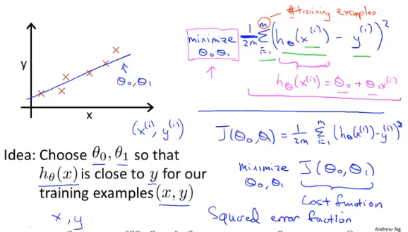
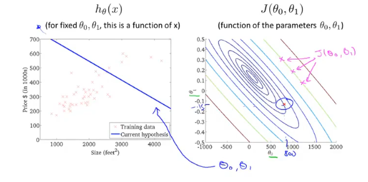
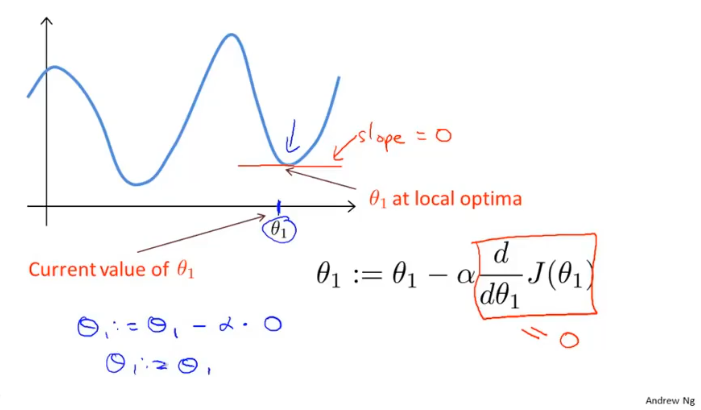
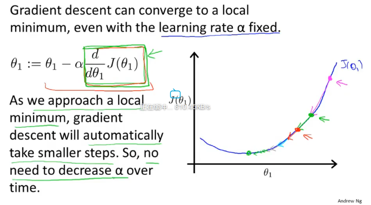
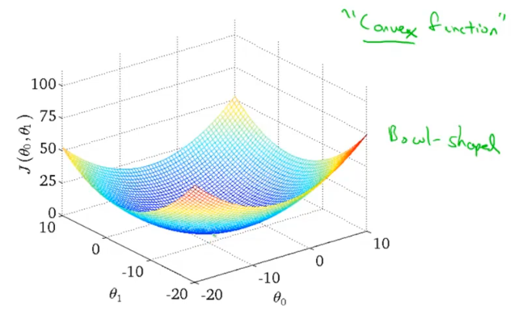

---

typora-copy-images-to: img\机器学习

---

## 监督学习

监督学习是已经知道数据的label，例如预测房价问题，给出了房子的面积和价格。

- 回归问题是预测连续值的输出，预测房价。

  

- 分类问题是预测离散值输出，例如判断肿瘤是良性还是恶性。

  

## 无监督学习

无监督学习是不知道数据具体的含义，比如给定一些数据，但是不知道它们具体的信息，无监督学习可以得到两个不同的聚类。

## 线性回归

线性回归是拟合一个直线，将训练数据尽可能分布到直线上。大多数只涉及到要给自变量和一个因变量称为一元线性回归，对于两个及以上的自变量且自变量和因变量是线性关系，称为多元线性回归。

## 代价函数

cost function，对于一般的回归问题，一般使用最小均方差来评估参数的好坏。

**$\theta_0 = 0$**

**$\theta_0 \neq 0$**

## 梯度下降

梯度下降的思路是为每个参数赋一个初值，然后预测使代价函数最小的方向，然后不断地调整参数，直到到达一个局部最优解。初值的不同可能会得到两个不同的结果。

梯度下降在具体的执行时，每部计算需要同时更新所有的参数。

梯度下降公式中有两个部分，学习率和偏导数。

偏导数，用来计算当前参数对应代价函数的斜率，导数为正则$\theta$减小，导数为负则$\theta$增大，通过这样的方式可以使整体向$\theta=0$收敛。

学习率$\alpha$用来描述学习率，每次参数改变的步长。$\alpha$的大小不好确定，如果太小，则需要很多步才能收敛，如果太大，最后可能不会收敛甚至可能发散。

当$\theta$处于局部最优解使，$\theta$的值将不再更新，因为偏导为0。

这也说明了如果学习率$\alpha$不改变，参数也可能会收敛，假设偏导$> 0$，因为偏导一直在向在减小，所以每次的步长也会慢慢减小，所以$\alpha$不需要额外的减小。

梯度下降每次更新的都需要进行偏导计算，这个偏导对应线性回归的代价函数。

对代价函数求导的结果为：

梯度下降的过程容易出现局部最优解：

但是线性回归的代价函数，往往是一个凸函数。它总能收敛到全局最优。

梯度下降过程的动图展示：

**Batch梯度下降**：每一步梯度下降，都需要遍历整个训练集样本。

## 矩阵和向量

一些数学计算转化为矩阵的形式，可以简化代码书写、提高效率、代码更容易理解。

