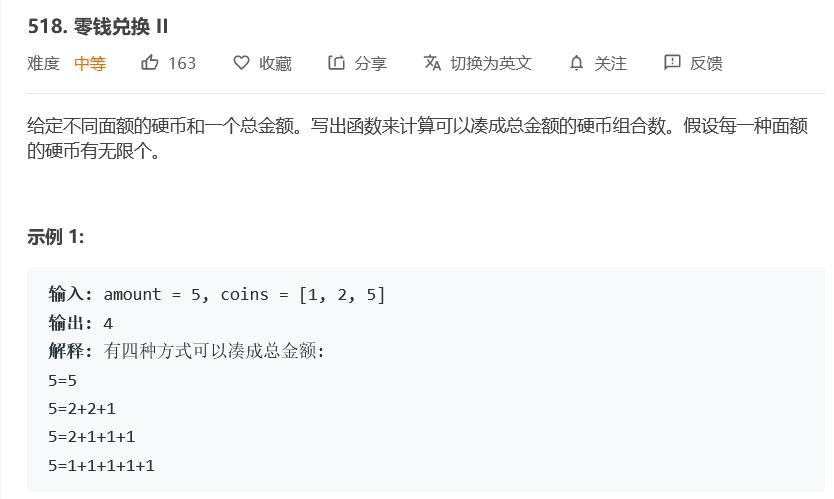
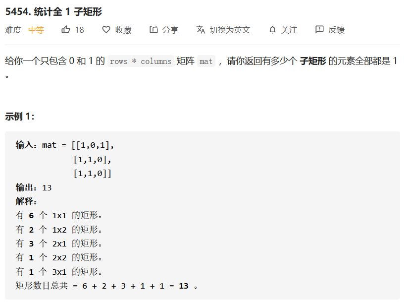
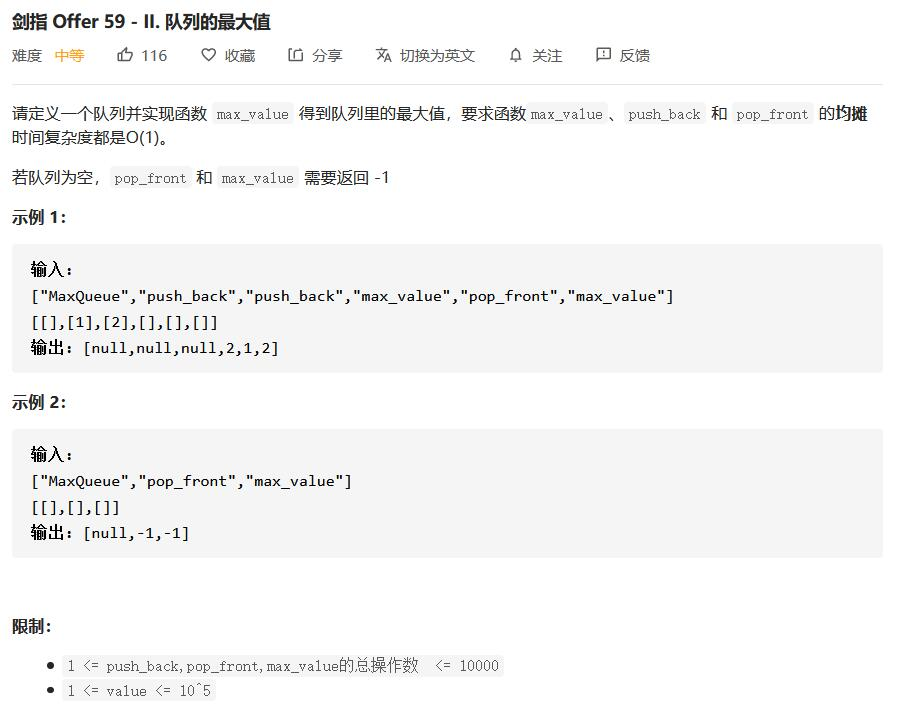
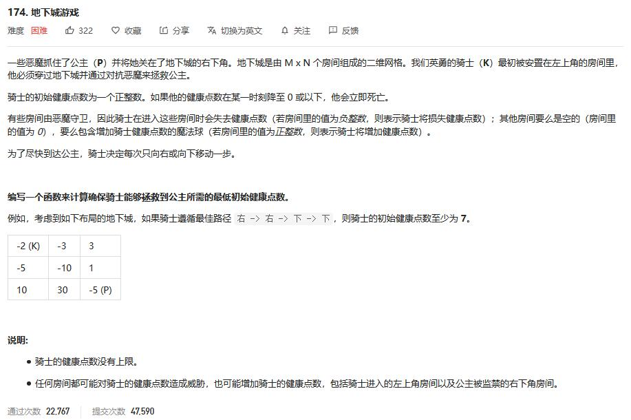

# 

# 多数元素

[题目链接](https://leetcode-cn.com/problems/majority-element/)

找到数组中众数（出现次数$>\lfloor\frac{n}{2}\rfloor$ ）

- 排序返回中间的数。$O(nlogn)$

- 哈希表（unordered_map）统计每个数出现的次数。$O(n)$
  - 随机找众数，期望是线性。$O(n)$
- Boyer-Moore 摩尔投票算法，维护一个候选变量和它出现的次数cnt，遍历数组，如果出现的数字不同，cnt--，如果相同cnt++，如果cnt=0就替换为新的数。最后剩下的数就是众数。$O(n)$

# 求众数 II

[题目链接](https://leetcode-cn.com/problems/majority-element-ii/)

出现次数$>\lfloor\frac{n}{3}\rfloor$ ，维护两个候选变量。

   ```c
int num1 = nums[0];
int num2 = nums[0];
int cnt1 = 0;
int cnt2 = 0;
for (int i = 0; i < len; ++i) {
    if (nums[i] == num1) cnt1++;
    else if (nums[i] == num2) cnt2++;
    else if (cnt1 == 0) num1 = nums[i], cnt1 = 1;
    else if (cnt2 == 0) num2 = nums[i], cnt2 = 1;
    else --cnt1, --cnt2;
}
   ```

# 搜索二维矩阵 II

[题目链接](https://leetcode-cn.com/problems/search-a-2d-matrix-ii/)

矩阵的性质是每行从左向右递增，每列从上到下递增。利用性质从左下角或右上角开始出发。

例如从右上角走，它往下走比它大，往左走比它小。利用这个性质直到数字相等为止。

```c
while (i < r && j >= 0) {
    if (matrix[i][j] > target) --j;
    else if (matrix[i][j] < target) ++i;
    else return true; 
}
return false;
```


# 最小栈
[题目链接](https://leetcode-cn.com/problems/min-stack/)

设计一个支持push、pop、top、getMin()的栈。

使用数据栈和辅助栈。

添加元素直接向data中push，helper栈维护栈顶为当前的最小值，每次push都和栈顶比较，小的话直接push，比栈顶大就把栈顶元素再push一份。

   ```c
void push(int x) {
    data.push(x);
    if (helper.empty() || helper.top() >= x) 
        helper.push(x);
    else
        helper.push(helper.top());
}

void pop() {
    data.pop();
    helper.pop();
}

int top() {
    return data.top();
}

int getMin() {
    return helper.top();
}
   ```

# 重构二叉树

[题目链接](https://leetcode-cn.com/problems/zhong-jian-er-cha-shu-lcof/submissions/)

   ```c
/**
    * Definition for a binary tree node.
    * struct TreeNode {
    *     int val;
    *     TreeNode *left;
    *     TreeNode *right;
    *     TreeNode(int x) : val(x), left(NULL), right(NULL) {}
    * };
    */
class Solution {
    public:
    map<int, int> mp;
    TreeNode* buildTree(vector<int>& preorder, vector<int>& inorder) {
        int len = preorder.size();
        map<int, int> mp;
        for (int i = 0; i < len; ++i) {
            mp[inorder[i]] = i;
        }
        return build(preorder, 0, len-1, inorder, 0, len-1, mp);
    }

    TreeNode* build(vector<int>& pre, int pl, int pr, vector<int>& vin, int vl, int vr, map<int,int>& mp) {
        if (pl > pr) return nullptr;
        // if (vl > vr) return nullptr;
        int num = pre[pl];
        TreeNode* cur = new TreeNode(num);
        int mid = mp[num];
        int L = mid - vl; // 左孩子个数
        int R = vr - mid; // 右孩子个数
        cur->left = build(pre, pl+1, pl+L, vin, vl, mid-1, mp);
        cur->right = build(pre, pl+L+1, pl+L+R, vin, mid+1, vr, mp);
        return cur;
    }
};
   ```


# 二叉树遍历

   ```c
//前序遍历
class Solution {
    public:
    vector<int> preorderTraversal(TreeNode* root) {
        vector<int> vec;
        stack<TreeNode*> sta;
        TreeNode* p = root;
        while (p || !sta.empty()) {
            while (p) {
                vec.push_back(p->val);
                sta.push(p);
                p = p->left;
            }
            p = sta.top();
            sta.pop();
            p = p->right;
        }
        return vec;
    }
};

// 中序遍历
class Solution {
    public:
    vector<int> inorderTraversal(TreeNode* root) {
        vector<int> vec;
        stack<TreeNode*> sta;
        TreeNode* p = root;
        while (p || !sta.empty()) {
            while (p) {
                sta.push(p);
                p = p->left;
            }
            p = sta.top();
            sta.pop();
            vec.push_back(p->val);
            p = p->right;
        }
        return vec;
    }

    void in(TreeNode* rt, vector<int>& vec) {
        if (rt == NULL) return;
        in(rt->left, vec);
        vec.push_back(rt->val);
        in(rt->right, vec);
    }
};

// 后序遍历
class Solution {
    public:
    vector<int> postorderTraversal(TreeNode* root) {
        vector<int> vec;
        stack<TreeNode*> sta;
        TreeNode* p = root;
        map<TreeNode*, int> mp;

        while (p || !sta.empty()) {
            while (p) {
                sta.push(p);
                mp[p]++;
                p = p->left;
            }
            p = sta.top();
            sta.pop();
            if (mp[p] == 2 || p->right == NULL) {
                vec.push_back(p->val);
                p = NULL;
            }else{
                sta.push(p);
                mp[p]++;
                p = p->right;
            }
        }
        return vec;
    }

    void post(TreeNode* rt, vector<int>& vec) {
        if (rt == NULL) return;
        post(rt->left, vec);
        post(rt->right, vec);
        vec.push_back(rt->val);
    }
};
   ```


# 验证二叉搜索树

[题目链接](https://leetcode-cn.com/explore/interview/card/top-interview-questions-easy/7/trees/48/)

   - 为每个点设置上下界
   - 检查中序遍历结果

   ```c
bool judge(TreeNode* root, long long down, long long up) {
    if (root == NULL) return true;
    if (root->left && root->left->val >= root->val) return false;
    if (root->right && root->right->val <= root->val) return false;

    if (root->left && root->left->val <= down) return false;
    if (root->right && root->right->val >= up) return false;
    return judge(root->left, down, root->val) && judge(root->right, root->val, up);
}
   ```

   

# 对称二叉树

[题目链接](https://leetcode-cn.com/problems/symmetric-tree/)

递归检查节点的对称性

```c
bool judge(TreeNode* l, TreeNode* r) {
    if (!l && !r) return true;
    if (!l || !r) return false;
    return (l->val == r->val) 
        && judge(l->left, r->right) 
        && judge(l->right, r->left);
}
```


# 循环链表的入口

[题目链接](https://www.nowcoder.com/questionTerminal/253d2c59ec3e4bc68da16833f79a38e4)


```c
class Solution {
public:
    ListNode* EntryNodeOfLoop(ListNode* pHead)
    {
        if(pHead == NULL || pHead->next == NULL) return NULL;
        ListNode* p1 = pHead;
        ListNode* p2 = pHead;
        while (p2 && p2->next) {
            p1 = p1->next;
            p2 = p2->next->next;
            if (p1 == p2) break;
        }
        if (p2 == NULL || p2->next == NULL) return NULL;
        p1 = pHead;
        while (p1 != p2) {
            p1 = p1->next;
            p2 = p2->next;
        }
        return p1;
    }
};
```


# 买卖股票2

[题目链接](https://leetcode-cn.com/problems/best-time-to-buy-and-sell-stock-ii/)

允许多次交易股票，每次手里只能持有一个股票。

利用峰谷法，只要涨就买。


# 最大正方形

[题目链接](https://leetcode-cn.com/problems/maximal-square/)

在一个01矩阵中，找到只包含1的最大正方形。


dp[i]\[j]表示以[i,j]为右下角的最大矩阵

dp[i]\[j] = min(dp[i-1]\[j], dp[i]\[j-1], dp[i-1]\[j-1]) + 1

```c
int ans = 0;
vector<vector<int>> dp;
vector<int> tmp(c+1);
dp.resize(r+1, tmp);

for (int i = 1; i <= r; ++i) {
    for (int j = 1; j <= c; ++j) {
        if (matrix[i-1][j-1] == '1') {
            dp[i][j] = min(min(dp[i-1][j], dp[i][j-1]), dp[i-1][j-1]) + 1;
            ans = max(ans, dp[i][j]);
        }
    }
}
return ans * ans;
```


# 俄罗斯套娃信封问题

[题目链接](https://leetcode-cn.com/problems/russian-doll-envelopes/)

每个信封(w,h)，信封1可以放到信封2的条件是$w_1 < w_2 \space and\space h_1 < h_2$，求最多多少个信封套在一起。

按照w升序排列，w相同h降序排列（套娃的条件是严格小），然后求h的最长上升子序列。

```c
sort(envelopes.begin(), envelopes.end(), [&](vector<int>& X, vector<int>& Y){
    if (X[0] != Y[0]) return X[0] < Y[0];
    else return X[1] > Y[1];
});
vector<int> num;
for (int i = 0; i < len; ++i) {
    num.push_back(envelopes[i][1]);
}
// 最长上升子序列
vector<int> tmp;
for (int i = 0; i < len; ++i) {
    auto it = lower_bound(tmp.begin(), tmp.end(), num[i]);
    if (it == tmp.end()) tmp.push_back(num[i]);
    else *it = num[i];
}
return tmp.size();
```


# 链表合并

```cpp
#include <bits/stdc++.h>
using namespace std;

struct Node{
  Node(int x): val(x), next(NULL) {}
  int val;
  Node* next;
};

// 尾插入
void insert(Node* link, Node* x) {
  Node* p = link;
  while (p->next) {
    p = p->next;
  }
  p->next = x;
}

// 打印
void show(Node* link) {
  Node* p = link;
  while (p) {
    cout << p->val << " ";
    p = p->next;
  }
  cout << endl;
}

// 合并
Node* merge(Node* link1, Node* link2) {
  // 使用头结点
  Node* ret = new Node(0);
  Node* p = ret;
  while (link1 && link2) {
    if (link1->val < link2->val) {
      p->next = new Node(link1->val);
      link1 = link1->next;
    }else {
      p->next = new Node(link2->val);
      link2 = link2->next;
    }
    p = p->next;
  }
  while (link1) {
    p->next = new Node(link1->val);
    p = p->next;
    link1 = link1->next;
  }

  while (link2) {
    p->next = new Node(link2->val);
    p = p->next;
    link2 = link2->next;
  }
  return ret->next;
}

int main(){

  // 初始化link1
  Node* link1= new Node(2);
  insert(link1, new Node(4));
  insert(link1, new Node(5));
  show(link1);
  // 初始化link1
  Node* link2= new Node(1);
  insert(link2, new Node(3));
  insert(link2, new Node(6));
  show(link2);
  // 合并
  Node* link = merge(link1, link2);
  show(link);

  return 0;
}
```


# LRU缓存机制

[题目链接](https://leetcode-cn.com/problems/lru-cache/)

LRU，最近很少使用，如果数据最近被访问过，那么将来被访问的几率也更高。

- 新数据插入到链表头部。
- 每当缓存命中，将数据移动到链表头部。
- 链表满，将链表尾部数据丢弃。

可以使用哈希表记录<key，Node*>，双向链表在删除元素的时候不需要额外信息。

```cpp
struct Node{
  int key;
  int val;
  Node* prev;
  Node* next;
};
class LRUCache {
public:
  LRUCache(int capacity) {
    this->capacity = capacity;
    this->size = 0;
    head = new Node;
    tail = new Node;
    head->next = tail;
    tail->prev = head;
  }

  void remove(Node *p) {
    Node *prev = p->prev;
    Node *next = p->next;
    prev->next = next;
    next->prev = prev;
    mp[p->key] = NULL;
    delete p;
  }

  void add(Node *p) {
    p->next = head->next;
    p->prev = head;
    head->next->prev = p;
    head->next = p;
    mp[p->key] = p;
  }

  int get(int key) {
    Node *p = mp[key];
    if (p == NULL) return -1;
    Node* q = new Node;
    q->val = p->val;
    q->key = p->key;
    remove(p);
    add(q);
    return q->val;
  }

  void put(int key, int value) {
    Node *p = mp[key];
    if (p == NULL) {
      Node* q = new Node;
      q->val = value;
      q->key = key;
      add(q);
      ++size;
      if (size > capacity) {
        remove(tail->prev);
        --size;
      }
    }else {
      Node* q = new Node;
      q->key = key;
      q->val = value;
      remove(p);
      add(q);
    }
  }

private:
  int size;
  int capacity;

  unordered_map<int, Node*> mp;
  Node* head;
  Node* tail;

};
```


# LFU

Least frequently used）最近不经常使用，如果一个数据在最近一段时间内使用的次数最少，那么在将来一段时间内被使用的可能性也小。

- 记录每个数据使用的次数和最后访问的时间。
- 当命中缓存，更新使用次数和最后访问的时间。
- 当空间满，优先删除使用次数少的数据，如果有多个，删除时间最老的那个。


哈希表+红黑树，哈希表记录<key, Node>，set记录每个Node。自定排序优先按照使用次数，然后是访问时间，删除的时候就是set的第一个元素。

哈希表的添加和查询是O(1)，set的添加和删除是O(logn)。总体复杂度O(logn)。

```cpp
struct Node{
  int cnt, time, key, value;
  Node() {}
  Node(int _cnt, int _time, int _key, int _value): cnt(_cnt), time(_time), key(_key), value(_value){}
  bool operator < (const Node &x) const{
    return cnt == x.cnt ? time < x.time : cnt < x.cnt;
  }
};

class LFUCache {
public:
    LFUCache(int capacity_) {
      capacity = capacity_;
      time = 0;
      mp.clear();
      st.clear();
    }

    int get(int key) {
      if (capacity == 0) return -1;
      auto it = mp.find(key);
      if (it == mp.end()) return -1;
      Node p = it->second;
      st.erase(p);
      p.cnt++;
      p.time = time++;
      st.insert(p);
      it->second = p;
      return p.value;
    }

    void put(int key, int value) {
      if (capacity == 0) return;
      auto it = mp.find(key);
      if (it == mp.end()) {
        if ((int)mp.size() == capacity) {
            mp.erase(st.begin()->key);
            st.erase(st.begin());
        }
        Node p = Node(1, time++, key, value);
        st.insert(p);
        mp[key] = p; // 需要默认构造
      }else {
        Node p = it->second;
        st.erase(p);
        p.cnt++;
        p.time = time++;
        p.value = value;
        st.insert(p);
        it->second = p;
      }
    }
private:
  unordered_map<int, Node> mp;
  set<Node> st;
  int capacity;
  int time;
};
```


# 机器人的运动范围

 

[题目链接](https://leetcode-cn.com/problems/ji-qi-ren-de-yun-dong-fan-wei-lcof/)

输入m, n, k，表示一个矩阵[m,n]。机器人从[0,0]出发，可以上下左右走，要求是格子[i,j]，i和j各位上的和不能大于k。求一共可以走多少个格子。

因为是从[0,0]开始走，向右和向下都是递增。所以只用判断向右或向下两个方向就行。

- 深度优先搜索

  ```cpp
  class Solution {
      // 计算 x 的数位之和
      int get(int x) {
        int ans = 0;
        while (x) {
          ans += x % 10;
          x /= 10;
        }
        return ans;
      }
  public:
      int movingCount(int m, int n, int k) {
          if (!k) return 1;
          queue<pair<int,int> > Q;
          // 向右和向下的方向数组
          int dx[2] = {0, 1};
          int dy[2] = {1, 0};
          vector<vector<int> > vis(m, vector<int>(n, 0));
          Q.push(make_pair(0, 0));
          vis[0][0] = 1;
          int ans = 1;
          while (!Q.empty()) {
              auto [x, y] = Q.front();
              Q.pop();
              for (int i = 0; i < 2; ++i) {
                  int tx = dx[i] + x;
                  int ty = dy[i] + y;
                  if (tx < 0 || tx >= m || ty < 0 || ty >= n || vis[tx][ty] || get(tx) + get(ty) > k) continue;
                  Q.push(make_pair(tx, ty));
                  vis[tx][ty] = 1;
                  ans++;
              }
          }
          return ans;
      }
  };
  ```

- 递归解法

  ```c
  class Solution {
    int getSum(int x) {
      int ret = 0;
      while (x) {
        ret += x % 10;
        x /= 10;
      }
      return ret;
    }
  public:
      int movingCount(int m, int n, int k) {
        if (!k) return 1;
        vector<vector<int> > vis(m, vector<int>(n, 0));
        int ret = 0;
        vis[0][0] = 1;
        for (int i = 0; i < m; ++i) {
          for (int j = 0; j < n; ++j) {
            if (getSum(i) + getSum(j) > k) continue;
            if (i > 0) vis[i][j] |= vis[i-1][j];
            if (j > 0) vis[i][j] |= vis[i][j-1];
            ret += vis[i][j];
          }
        }
        return ret;
      }
  };
  ```


# 顺时针打印矩阵（模拟）

[题目链接](https://leetcode-cn.com/problems/shun-shi-zhen-da-yin-ju-zhen-lcof/)

```cpp
class Solution {
public:
    vector<int> spiralOrder(vector<vector<int>>& matrix) {
        vector<int> ret;
        if (matrix.empty()) return ret;
        int n = matrix.size();
        int m = matrix[0].size();
        int l = 0, r = m-1, t = 0, d = n-1;
        while (true) {
            for (int i = l; i <= r; ++i) ret.push_back(matrix[t][i]);
            ++t;
            if (t > d) break;
            
            for (int i = t; i <= d; ++i) ret.push_back(matrix[i][r]);
            --r;
            if (r < l) break;

            for (int i = r; i >= l; --i) ret.push_back(matrix[d][i]);
            --d;
            if (d < t) break;

            for (int i = d; i >= t; --i) ret.push_back(matrix[i][l]);
            ++l;
            if (l > r) break;
        }

        return ret;
    }
};
```


# 零钱兑换II（动态规划）

[题目链接](https://leetcode-cn.com/problems/coin-change-2/)




```cpp
class Solution {
public:
    int change(int amount, vector<int>& coins) {
        vector<int> dp(amount+1);
        dp[0] = 1;
        for (int i = 0; i < coins.size(); ++i) {
            for (int j = coins[i]; j <= amount; ++j) {
                dp[j] += dp[j-coins[i]];
            }
        }
        return dp[amount];
    }
};
```

# 最长有效括号


[题目连接](https://leetcode-cn.com/problems/longest-valid-parentheses/)

**动态规划**

```cpp
class Solution {
public:
    int longestValidParentheses(string s) {
        int maxans = 0, n = s.length();
        vector<int> dp(n, 0);
        for (int i = 1; i < n; i++) {
            if (s[i] == ')') {
                if (s[i - 1] == '(') {
                    dp[i] = (i >= 2 ? dp[i - 2] : 0) + 2;
                } else if (i - dp[i - 1] > 0 && s[i - dp[i - 1] - 1] == '(') {
                    dp[i] = dp[i - 1] + ((i - dp[i - 1]) >= 2 ? dp[i - dp[i - 1] - 2] : 0) + 2;
                }
                maxans = max(maxans, dp[i]);
            }
        }
        return maxans;
    }
};
```


**栈**

```cpp
class Solution {
public:
    int longestValidParentheses(string s) {
        stack<int> sta;
        sta.push(-1);
        int ans = 0;
        for (int i = 0; i < s.size(); ++i) {
            if (s[i] == '(') sta.push(i);
            else {
                sta.pop();
                if (sta.empty()) sta.push(i);
                else ans = max(ans, i - sta.top());
            }
        }
        return ans;
    }
};
```


# 统计全1子矩阵

[题目链接](https://leetcode-cn.com/problems/count-submatrices-with-all-ones/)



- 方法1：枚举矩阵的右下角，统计每个1最左连续的个数，然后枚举向上扩充的个数。
- 方法2：如果只有一行规律为$1+2+\cdots+n$，如果有多行只有上下都为1才对答案有贡献，所以取$\&$之后按照只有一行的情况求解。

```cpp
class Solution {
public:
    int numSubmat(vector<vector<int>>& mat) {
        // 枚举右下角
        int r = mat.size();
        int c = mat[0].size();
        vector<vector<int> > left(r, vector<int>(c, 0));
        for (int i = 0; i < r; ++i) {
            int cnt = 0;
            for (int j = 0; j < c; ++j) {
                if (mat[i][j] == 1) cnt++;
                else cnt = 0;
                left[i][j] = cnt;
            }
        }
        int ans = 0;
        for (int i = 0; i < r; ++i) {
            for (int j = 0; j < c; ++j) {
                if (!mat[i][j]) continue;
                int mi = 1000;
                for (int k = i; k >= 0; --k) {
                    mi = min(mi, left[k][j]);
                    ans += mi;
                }
            }
        }
        return ans;
    }
};
```

```cpp
class Solution {
public:
    int numSubmat(vector<vector<int>>& mat) {
        int r = mat.size();
        int c = mat[0].size();
        int ans = 0;
        for (int i = 0; i < r; ++i) {
            vector<int> tmp(c, 1);
            for (int j = i; j < r; ++j) {
                for (int k = 0; k < c; ++k) {
                    tmp[k] &= mat[j][k];
                }
                ans += getCnt(tmp, c);
            }
        }
        return ans;
    }
    
    int getCnt(vector<int>& tmp, int c) {
        int now = 0;
        int cnt = 0;
        for (int i = 0; i < c; ++i) {
            if (tmp[i] == 0) {
                cnt += now * (now+1) / 2;
                now = 0;
            }else {
                now++;
            }
        }
        cnt += now * (now+1) / 2;
        return cnt;
    }
};
```


# 队列的最大值

[题目链接](https://leetcode-cn.com/problems/dui-lie-de-zui-da-zhi-lcof/)



单调队列

```cpp
class MaxQueue {
private:
    deque<int> mque;
    queue<int> que;

public:
    MaxQueue() {
        mque.clear();
        while (!que.empty()) que.pop();
    }
    
    int max_value() {
        if (que.empty()) return -1;
        return mque.front();
    }
    
    void push_back(int value) {
        que.push(value);
        while (!mque.empty() && mque.back() < value) {
            mque.pop_back();
        }
        mque.push_back(value);
    }
    
    int pop_front() {
        if (que.empty()) return -1;
        int ret = que.front();
        que.pop();
        if (ret == mque.front()) mque.pop_front();
        return ret;
    }
};
```


# 地下城游戏

[题目链接](https://leetcode-cn.com/problems/dungeon-game/)



动态规划。

不能从左上角开始，因为这样只能得到当前点到起点的最小值，不满足动态规划的无后效性。


最好的办法是从右下角开始，这样就避免对后续结果的影响。


```cpp
class Solution {
public:
    int calculateMinimumHP(vector<vector<int>>& dungeon) {
        int r = dungeon.size(), c = dungeon[0].size();
        vector<vector<int>> dp(2, vector<int>(c+1, INT_MAX));
        dp[1][c-1] = max(1, 1 - dungeon[r-1][c-1]);
        int now = 0;
        for (int i= r-1; i >= 0; --i) {
            now ^= 1;
            for (int j = c-1; j >= 0; --j) {
                if (i == r-1 && j == c-1) continue;
                dp[now][j] = max(1, min(dp[now^1][j], dp[now][j+1]) - dungeon[i][j]);
            }
        }
        return dp[now][0];
    }
};
```


